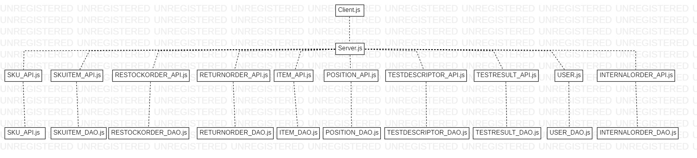

# Integration and API Test Report

Date:

Version:

# Contents

- [Dependency graph](#dependency graph)

- [Integration approach](#integration)

- [Tests](#tests)

- [Scenarios](#scenarios)

- [Coverage of scenarios and FR](#scenario-coverage)
- [Coverage of non-functional requirements](#nfr-coverage)

# Dependency graph 

     
# Integration approach
    
The integration approach that the team adopted is a **bottom up** approach, where:
* the lowest layer is that of the *DAO classes* which have been individually tested by means of unit tests

* the upper layer is that of the API, whose integration has been directly tested through API testing.

The team opted for an *incremental integration* strategy instead of designing mockups. The reason for this choice is due to one main reason:

since we deployed a 2-level software design, the underlying layer has already been completely tested by unit testing, performed with the goal of obtaining an as high as possible coverage. This strategy makes the API layer integration faster and easier, since we are almost sure that the underlying DAO layer behaves as expected. This was also a point in our favor, considering the tighness of the deadlines.

The strategy was to test the highest number of cases in order to guarantee an high scenario coverage and a reliabile software (scrivere bene): an high effort has been dedicated both in the unit test (for guaranteeing an high statements, branches, functions and lines coverage)

# API testing - Scenarios

## Use case 5.0.1 (before UC 5.1) - Supplier adds transport note to restock order

|Actors involved|Supplier |
|---------------|---------------|
|Precondition   | Supplier S logged in |
|               | Restock order RO exists and state = DELIVERY |
|Post condition | RO updated with transport note |
|Nominal scenario| S adds transport note containing delivery date to a restock order RO |
|Variants| Delivery date < RO issue date, abort transaction|
|        | RO not in DELIVERY state, abort transaction |

## Scenario UC5-0-1-1

| Scenario | Add new transport note |
| ------------- |:-------------:| 
|  Precondition     | Supplier S logged in |
| | Restock order RO exists and state = DELIVERY |
|  Post condition     | RO updated with transport note |
| Step#        | Description  |
|  1     |  S inserts new transport note |  
|  2     |  S fills the TN with the delivery date |
|  3     |  S updates the RO with the transport note|

## Scenario UC5-0-1-2

| Scenario | Add new transport note |
| ------------- |:-------------:| 
|  Precondition     | Supplier S logged in |
| | Restock order RO exists and state = DELIVERY |
|  Post condition     | RO updated with transport note |
| Step#        | Description  |
|  1     |  S inserts new transport note |  
|  2     |  S fills the TN with the delivery date |
|  3     | Transaction aborted: delivery date < RO issue date |

*Also the other variants are tested by the proper API test*

## Use case 13 - Manage sku items

|Actors involved| Clerk |
|---------------|---------------|
|Precondition   | Clerk C logged in |
|Post condition | SKU item created, modified or deleted |
|Nominal scenario| C defines a new sku item SI and its fields |
|Variants        | C modifies fields of an existing sku item SI |

## Scenario UC13-1

| Scenario |  Create Sku item SI |
| ------------- |:-------------:| 
|  Precondition     | Clerk C exists and is logged in |
|  Post condition     | SI into the system with an associated SKU and no availability |
| Step#        | Description  |
|  1     |  C inserts new SKU item rfid |  
|  2     |  C inserts new SKU id |
|  3     |  C inserts new date of stock|

## Scenario UC13-2

| Scenario |  Modify Sku item |
| ------------- |:-------------:| 
|  Precondition     | Clerk C exists and is logged in |
| | Sku item SI exists |
|  Post condition     | Sku item RFID, availability, date of stock modified  |
| Step#        | Description  |
|  1     |  C sets new SKU item rfid |  
|  2     |  C sets new availability value |
|  3     |  C selects new date of stock|

## Scenario UC13-3

| Scenario |  Delete Sku item |
| ------------- |:-------------:| 
|  Precondition     | Clerk C exists and is logged in |
| | Sku item SI exists |
|  Post condition     | Sku item SI deleted |
| Step#        | Description  |
|  1     |  C selects Sku item SI |  
|  2     |  C confirms the cancellation of SI |

# Coverage of Scenarios and FR

*Note*: (p) stands for partially (i.e. just one or few more steps of the scenario are covered by the specific test)

*Note*: Scenarios marked with (new) tag are the scenarios which have been added in the document

Only the portion of API tests that satisfied (at least partially) the scenarios provided in the officialRequirements.md document has been inserted in the table.
Instead, in the code there are further tests that verify the correct behaviour of most of the APIs

| Scenario ID | Functional Requirements covered | Mocha  Test(s) | 
| ----------- | ------------------------------- | ----------- | 
| 13-1 (new), 10-1 (p), 5-1-1(p)             | 5.8.1, 5.8.3                    |  testRestockOrder.js > test /api/skuitem                        |             
| 13-2 (new), 6-1 (p), 6-2 (p), 10-1 (p)     | -                               |  testRestockOrder.js > test put /api/skuitems/:rfid             |             
| 13-3 (new)                                 | 6.10                            |  testRestockOrder.js > test /api/skuitems/sku/:id               |             
| 3-1, 3-2                                   | 5.1, 5.2, 5.3, 5.4, 5.5, 5.6    |  testRestockOrder.js > test /api/restockOrder                   |             
| 5-1-1                                      | 5.8                             |  testRestockOrder.js > test /api/restockOrder/:id/skuItems      |             
| 5-1-1 (p), 5-3-1 (p), 5-3-2 (p), 5-3-3 (p) | 5.7                             |  testRestockOrder.js > test /api/restockOrder/:id               |  
| 6-1 (p), 6-2 (p)                           | 5.10                            |  testRestockOrder.js > test /api/restockOrders/:id/returnItems  |             
| 5-0-1-1, 5-0-1-2 (new)                     |                                 |  testRestockOrder.js > test put /api/restockOrder/:id/transportNote |  
| 1-1                                        |  2.1                            | testSku.js > test post /api/sku --- body:data        |             
| 1-3                                        |  2.1                            | testSku.js > test put /api/sku/:skuId  --- body:data   |  
| 1-2                                        |  2.1                            | testSku.js > test put /api/sku/:skuId/position  --- body:data|             
| -                                          |  2.2                               | testSku.js > test delete /api/skus/:skuId   |  
| -                                          |  2.3                               | testSku.js >  test get /api/skus    |             
| 2.1                                 |  3.1.1   | testPositon.js > test post /api/position --- body:data      |  
| 2.3, 2,4                              |  3.1.1              | testPositon.js > test put /api/position/:positionID  --- body:data|             
| 2.2                                       |  3.1.1          | testPositon.js > test put /api/position/:positionID/changeID  --- body:data    |  
| 2.5                                        | 3.1.2           |   testPositon.js > test delete /api/position/:positionID       |     
| -                                        | 3.1.3                                | testPositon.js > test get /api/positions   |   
|6-1 | 5.9 - 5.10 - 5.11 | testReturnOrder.js > test post /api/returnOrder --- body:data |
|11-1 | 7 | testItem.js > test post /api/item --- body:data |
|11-2 | 7 | testItem.js > test put /api/item/:id --- body:data |
| 9-1, 9-2, 9-3 | 6.1, 6.2 | testInternalOrder.js > test post /api/InternalOrders --- body:data |
| 10-1 | 6.3 | testInternalOrder.js > test put /api/internalOrders/:id --- body:data |
| - | 6.4 | testInternalOrder.js > test put /api/internalOrders/:id --- body:data |
| - | 6.5, 6.6, 6.7, 6.8 | testInternalOrder.js > test put /api/internalOrders/:id --- body:data |
| 3-2 (p) | 5.5 | testUser.js > test get /api/suppliers |
| 4-2 (p) | 1.3 | testUser.js > test /api/users |
| 4-1 | 1.1, 4.1 | testUser.js > test post /api/newUser |
| 4-2 | 1.1, 4.1 | testUser.js > test put /api/users/:username |
| 4-3 | 1.2, 4.2 | testUser.js > test delete /api/users/:username/:type |
| 12-1 | 3.2.1 | testDescriptor.js > test post /api/testDescriptor |
| 12-2 | 3.2.2 | testDescriptor.js > test put /api/testDescriptor/:id |
| 12-3 | 3.2.3 | testDescriptor.js > test delete /api/testDescriptor/:id |
| 5-2-1 (p), 5-2-2(p), 5-2-3 (p) | 3.2.1, 5.8.2 | testTestResults.js > test /api/skuitems/testResult |
| - | 3.2.2 | testTestResults.js > test put /api/skuitems/:rfid/testResult/:id |
| 6-1(p), 6-2(p) | 3.2.3 | testTestResults.js > test delete /api/skuitems/:rfid/testResult/:id |
| 5-3-2 (p), 5-3-3 (p), 6-1(p), 6-2(p) | 3.2.3 | testTestResults.js > test get /api/skuitems/:rfid/testResults |

# Coverage of Non Functional Requirements

### 

| Non Functional Requirement | Test name |
| -------------------------- | --------- |
| RFID is a string of 32 digits    | testSkuItem.js > test /api/skuitem |
|                                  | testSkuItem.js > test put /api/skuitems/:rfid |
|                                  | testSkuItem.js > test get /api/skuitems/:rfid (both correct and wrong case) |
|                                  | testSkuItem.js > test delete /api/skuitems/:rfid|
|                                  | testTestResults.js > test /api/skuitems/testResult |
|                                  | testTestResults.js > test get /api/skuitems/:rfid/testResults (both correct and wrong case) |
|                                  | testTestResults.js > test get /api/skuitems/:rfid/testResults/:id (correct and wrong rfid and/or id) |
|                                  | testTestResults.js > test put /api/skuitems/:rfid/testResult/:id |
|                                  | testTestResults.js > test delete /api/skuitems/:rfid/testResult/:id |
| Date Format is YYYY/MM/GG HH:MM  | testRestockOrder.js > test put /api/restockOrder/:id/transportNote |
|                                  | testRestockOrder.js > test /api/restockOrders          |
|                                  | testSkuItem.js > test /api/skuitem |
|                                  | testSkuItem.js > test /api/skuitem |
|                                  | testSkuItem.js > test put /api/skuitems/:rfid |
|                                  | testReturnOrder.js > test post /api/returnOrder |
|                                  | testTestResults.js > test /api/skuitems/testResult |
|                                  | testTestResults.js > test put /api/skuitems/:rfid/testResult/:id |
|                                  | testInternalOrder.js > test post /api/internalOrders |
|                                  | testInternalOrder.js > test get /api/internalOrders |
|                                  | testInternalOrder.js > test get /api/internalOrdersIssued |
|                                  | testInternalOrder.js > test get /api/internalOrdersAccepted |
|                                  | testInternalOrder.js > test getById correct /api/internalOrders/:id (correct id) |
|                                  | testInternalOrder.js > test getById wrong /api/internalOrders/:id (wrong id) |
|                                  | testInternalOrder.js > test put /api/internalOrders/:id |
|                                  | testInternalOrder.js > test delete /api/internalOrders/:id') |
|Position ID is the unique identifier of a position, 12 digits, and is derived from aisle (4digits) row (4 digits) col (4 digits), 4 first digits for aisle, middle 4 for row, last 4 for col| testPosition.js > test post /api/position |
|                                   |  testPosition.js > test put /api/position/:positionID |
|                                   |  testPosition.js > test put /api/position/:positionID/changeID |
|                                   | testPosition.js > test delete /api/position/:positionID |
|                                   | testSku.js > test put /api/sku/:skuId/position |
| Position Volume is expressed in cube meters | testPosition.js > test post /api/position |
|                                     | testPosition.js > test put /api/position/:positionID |
| Position Weight is expressed in kilograms | testPosition.js > test post /api/position |
|                                     | testPosition.js > test put /api/position/:positionID |
|                                     | testItem.js > test post /api/item |
|                                     | testItem.js > test get /api/items |
|                                     | testItem.js > test getById correct /api/items/:id (wrong correct id) |
|                                     | testItem.js > test getById wrong /api/items/:id (wrong correct id) |
|                                     | testItem.js > test put /api/item/:id |
|                                     | testItem.js > test delete /api/items/:id |

