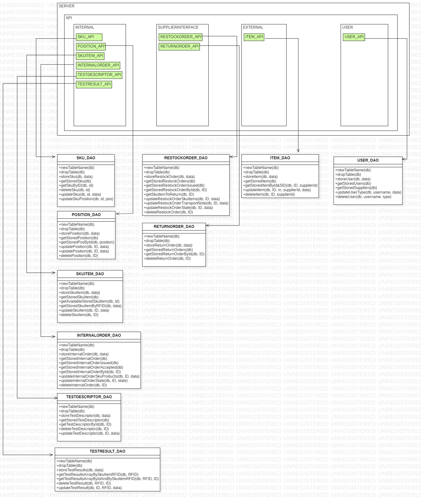

# Design Document 

Authors: 

Date: 23/04/2022

Version: 1

# Contents

- [High level design](#package-diagram)
- [Low level design](#class-diagram)
- [Verification traceability matrix](#verification-traceability-matrix)
- [Verification sequence diagrams](#verification-sequence-diagrams)

# Instructions

The design must satisfy the Official Requirements document, notably functional and non functional requirements, and be consistent with the APIs

# High level design 

A potential high level pattern that could be suitable to the EZWh system is that of a an abstract machine architectural style for building the EZWh system, dividing the code in two main packages:

* data: is the package containing a set of classes that represents the underlying data structure to be used in EZWh

* interface: is a package consisting of a set of methods that will allow the user to interface (read and write) to lists of data whose structure is defined in the underlying data layer.

However, given the small size of the project and the small number of classes currently designed, it was decided not to add further complexity in terms of architectural pattern: all the classes are included inside one single package.

Due to the small size of the project, it was rather decided to use a structure low level pattern, that is the façade pattern, as described in the next paragraph.

# Low level design

The following model suggests the use of the façade low-level pattern, according to which the user interfaces to the system only through the access methods provided by the "Warehouse" class, preventing the user from being able to directly access the data classes.
This solution aims to make the changes of the classes underlying the façade class (Warehouse) as irrelevant towards user-side interfacing

# Verification traceability matrix

| | Warehouse | SKU | SKUItem | Position | Test Descriptor | Test Result | Internal Order | Return Order | Restock Order | Transport Note | User | Item | Supplier | Customer |
| ----- |:-------:|:------:|:-------:|:-------:|:------:|:-------:|:-------:|:-------:|:-------:|:-------:|:-------:|:------:|:-------:|:-------:|
| FR1     | X |   |   |   |   |   |   |   |   |   | X |   |   |   |
| FR1.1   | X |   |   |   |   |   |   |   |   |   | X |   |   |   |
| FR1.2   | X |   |   |   |   |   |   |   |   |   | X |   |   |   |
| FR1.3   | X |   |   |   |   |   |   |   |   |   | X |   |   |   |
| FR1.4   | X |   |   |   |   |   |   |   |   |   | X |   |   |   |
| FR1.5   | X |   |   |   |   |   |   |   |   |   | X |   |   |   |
| FR2     | X | X |   |   |   |   |   |   |   |   |   |   |   |   |
| FR2.1   | X | X |   |   |   |   |   |   |   |   |   |   |   |   |
| FR2.2   | X | X |   |   |   |   |   |   |   |   |   |   |   |   |
| FR2.3   | X | X |   |   |   |   |   |   |   |   |   |   |   |   |
| FR2.4   | X | X |   |   |   |   |   |   |   |   |   |   |   |   |
| FR3     | X |   |   | X |   |   |   |   |   |   |   |   |   |   |
| FR3.1   | X |   |   | X |   |   |   |   |   |   |   |   |   |   |
| FR3.1.1 | X |   |   | X |   |   |   |   |   |   |   |   |   |   |
| FR3.1.2 | X |   |   | X |   |   |   |   |   |   |   |   |   |   |
| FR3.1.3 | X |   |   | X |   |   |   |   |   |   |   |   |   |   |
| FR3.1.4 | X |   |   | X |   |   |   |   |   |   |   |   |   |   |
| FR3.2   | X |   |   |   | X | X |   |   |   |   |   |   |   |   |
| FR3.2.1 | X |   |   |   | X | X |   |   |   |   |   |   |   |   |
| FR3.2.2 | X |   |   |   | X | X |   |   |   |   |   |   |   |   |
| FR3.2.3 | X |   |   |   | X | X |   |   |   |   |   |   |   |   |
| FR 4    | X |   |   |   |   |   |   |   |   |   | X |   |   | X |
| FR4.1   | X |   |   |   |   |   |   |   |   |   | X |   |   | X |
| FR4.2   | X |   |   |   |   |   |   |   |   |   | X |   |   | X |
| FR4.3   | X |   |   |   |   |   |   |   |   |   | X |   |   | X |
| FR4.4   | X |   |   |   |   |   |   |   |   |   |   |   |   |   |
| FR5     | X | X | X | X | X | X |   | X | X |   |   |   | X |   |
| FR5.1   | X |   |   |   |   |   |   |   | X |   |   |   |   |   |
| FR5.2   | X | X |   |   |   |   |   |   | X |   |   |   |   |   |
| FR5.3   | X | X |   |   |   |   |   |   | X |   |   |   |   |   |
| FR5.4   | X |   |   |   |   |   |   |   | X |   |   |   |   |   |
| FR5.5   | X |   |   |   |   |   |   |   | X |   |   |   | X |   |
| FR5.6   | X |   |   |   |   |   |   |   | X |   |   |   |   |   |
| FR5.7   | X |   |   |   |   |   |   |   | X |   |   |   |   |   |
| FR5.8   | X |   | X |   | X | X |   |   |   |   |   |   |   |   |
| FR5.8.1 | X |   | X |   |   |   |   |   |   |   |   |   |   |   |
| FR5.8.2 | X |   | X |   | X | X |   |   |   |   |   |   |   |   |
| FR5.8.3 | X |   | X | X |   |   |   |   | X |   |   |   |   |   |
| FR5.9   | X |   |   |   |   |   |   | X |   |   |   |   |   |   |
| FR5.10  | X |   | X |   |   |   |   | X | X |   |   |   |   |   |
| FR5.11  | X |   |   |   |   |   |   | X |   |   |   |   |   |   |
| FR5.12  | X |   |   |   |   |   |   | X |   |   |   |   |   |   |
| FR6     | X | X | X |   |   |   | X |   |   | X |   |   |   |   |
| FR6.1   | X |   |   |   |   |   | X |   |   |   |   |   |   |   |
| FR6.2   | X | X |   |   |   |   | X |   |   |   |   |   |   |   |
| FR6.3   | X | X |   |   |   |   | X |   |   |   |   |   |   |   |
| FR6.4   | X | X |   |   |   |   | X |   |   |   |   |   |   |   |
| FR6.5   | X |   |   |   |   |   | X |   |   |   |   |   |   |   |
| FR6.6   | X |   |   |   |   |   | X |   |   |   |   |   |   |   |
| FR6.7   | X |   |   |   |   |   | X |   |   |   |   |   |   |   |
| FR6.8   | X |   |   |   |   |   | X |   |   | X |   |   |   |   |
| FR6.9   | X |   | X |   |   |   |   |   |   |   |   |   |   |   |
| FR6.10  | X |   | X |   |   |   |   |   |   |   |   |   |   |   |
| FR7     | X |   |   |   |   |   |   |   |   |   |   | X |   |   |

# Verification sequence diagrams 
