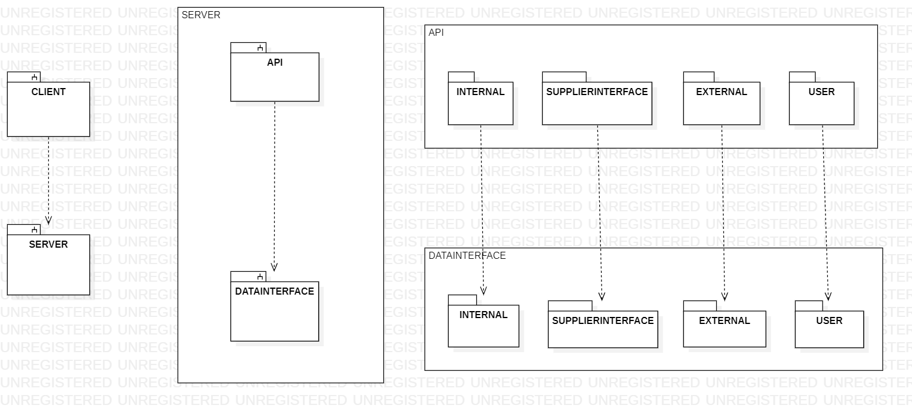

# Design Document 

Authors: 

Date: 23/04/2022

Version: 2.0 (change1 update in low_level.png)

# Contents

- [High level design](#package-diagram)
- [Low level design](#class-diagram)
- [Verification traceability matrix](#verification-traceability-matrix)
- [Verification sequence diagrams](#verification-sequence-diagrams)

# Instructions

The design must satisfy the Official Requirements document, notably functional and non functional requirements, and be consistent with the APIs

# High level design 

EzWh uses a client-server architectural pattern:
* Client: is a react webpage that provides a GUI to the user, which allows him to interact with the server via API calls
* Server: serves client requests by exposing APIs, which are able to interact with the database using an internal layer (datainterface) of classes (DAO) and functions.

Furthermore an high level pattern that we considered do be suitable to the EZWh server is that of a an abstract machine architectural style, obtained by dividing the code in two main packages:

* API: is the package containing all the APIs exposed by the server, internally divided into subfolders and subfiles so that the APIs are organized by functionality (the functionalities taken into consideration are those provided by the official requirements document)
    * Internal: it contains all the APIs that allow the user to interact with functionalities and data which are considered as "internal" to the warehouse
    * SupplierInterface: it contains the APIs that allow the user to interact with a Supplier
    * External: it contains all the APIs exposed to suppliers, allowing them to interact with their own data

* DataInterface: As the name suggests, this is the database interface layer: this layer contains a class (DAO) for each functionality so that each API file of the upper layer can interface to the database through a function offered by the associated DAO.
The internal structure of the "datainterface" layer re-proposes the structure of the API package, therefore it presents a division by functionality ("Internal", "SupplierInterface", "External")

# Low level design

The following model suggests the use of the façade low-level pattern, according to which the user interfaces to the database only via API exposed by the server, preventing the user from being able to directly access the DAO classes.
This solution aims to make the changes of the classes and the data underlying the façade (API) as irrelevant towards user-side interfacing.

# Verification traceability matrix

|| SKU | SKUItem | Position | Test Descriptor | Test Result | Internal Order | Return Order | Restock Order | User | Item |
| ----- |:------:|:-------:|:-------:|:------:|:-------:|:-------:|:-------:|:-------:|:-------:|:------:|
| FR1     |   |   |   |   |   |   |   |   | X |   |
| FR1.1   |   |   |   |   |   |   |   |   | X |   |
| FR1.2   |   |   |   |   |   |   |   |   | X |   |
| FR1.3   |   |   |   |   |   |   |   |   | X |   |
| FR1.4   |   |   |   |   |   |   |   |   | X |   |
| FR1.5   |   |   |   |   |   |   |   |   | X |   |
| FR2     | X |   |   |   |   |   |   |   |   |   |
| FR2.1   | X |   |   |   |   |   |   |   |   |   |
| FR2.2   | X |   |   |   |   |   |   |   |   |   |
| FR2.3   | X |   |   |   |   |   |   |   |   |   |
| FR2.4   | X |   |   |   |   |   |   |   |   |   |
| FR3     |   |   | X |   |   |   |   |   |   |   |
| FR3.1   |   |   | X |   |   |   |   |   |   |   |
| FR3.1.1 |   |   | X |   |   |   |   |   |   |   |
| FR3.1.2 |   |   | X |   |   |   |   |   |   |   |
| FR3.1.3 |   |   | X |   |   |   |   |   |   |   |
| FR3.1.4 |   |   | X |   |   |   |   |   |   |   |
| FR3.2   |   |   |   | X | X |   |   |   |   |   |
| FR3.2.1 |   |   |   | X | X |   |   |   |   |   |
| FR3.2.2 |   |   |   | X | X |   |   |   |   |   |
| FR3.2.3 |   |   |   | X | X |   |   |   |   |   |
| FR 4    |   |   |   |   |   |   |   |   | X |   |
| FR4.1   |   |   |   |   |   |   |   |   | X |   |
| FR4.2   |   |   |   |   |   |   |   |   | X |   |
| FR4.3   |   |   |   |   |   |   |   |   | X |   |
| FR4.4   |   |   |   |   |   |   |   |   |   |   |
| FR5     | X | X | X | X | X |   | X | X | X  |   
| FR5.1   |   |   |   |   |   |   |   | X |   |   |
| FR5.2   | X |   |   |   |   |   |   | X |   |   |
| FR5.3   | X |   |   |   |   |   |   | X |   |   |
| FR5.4   |   |   |   |   |   |   |   | X |   |   |
| FR5.5   |   |   |   |   |   |   |   | X | X  |   
| FR5.6   |   |   |   |   |   |   |   | X |   |   |
| FR5.7   |   |   |   |   |   |   |   | X |   |   |
| FR5.8   |   | X |   | X | X |   |   |   |   |   |
| FR5.8.1 |   | X |   |   |   |   |   |   |   |   |
| FR5.8.2 |   | X |   | X | X |   |   |   |   |   |
| FR5.8.3 |   | X | X |   |   |   |   | X |   |   |
| FR5.9   |   |   |   |   |   |   | X |   |   |   |
| FR5.10  |   | X |   |   |   |   | X | X |   |   |
| FR5.11  |   |   |   |   |   |   | X |   |   |   |
| FR5.12  |   |   |   |   |   |   | X |   |   |   |
| FR6     | X | X |   |   |   | X |   |   |   |   |
| FR6.1   |   |   |   |   |   | X |   |   |   |   |
| FR6.2   | X |   |   |   |   | X |   |   |   |   |
| FR6.3   | X |   |   |   |   | X |   |   |   |   |
| FR6.4   | X |   |   |   |   | X |   |   |   |   |
| FR6.5   |   |   |   |   |   | X |   |   |   |   |
| FR6.6   |   |   |   |   |   | X |   |   |   |   |
| FR6.7   |   |   |   |   |   | X |   |   |   |   |
| FR6.8   |   |   |   |   |   | X |   |   |   |   |
| FR6.9   |   | X |   |   |   |   |   |   |   |   |
| FR6.10  |   | X |   |   |   |   |   |   |   |   |
| FR7     |   |   |   |   |   |   |   |   |   | X |

# Verification sequence diagrams 

