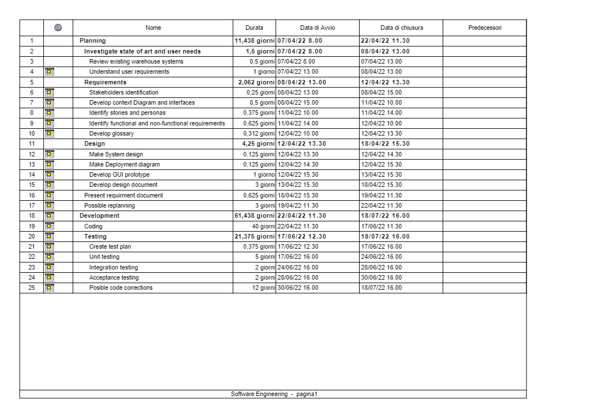
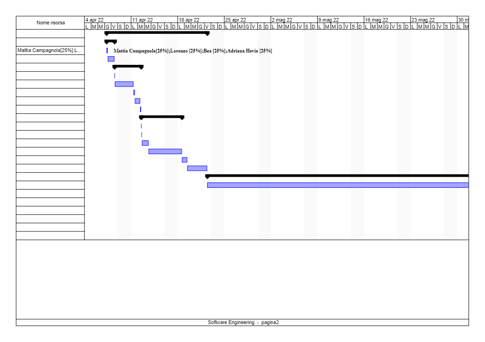
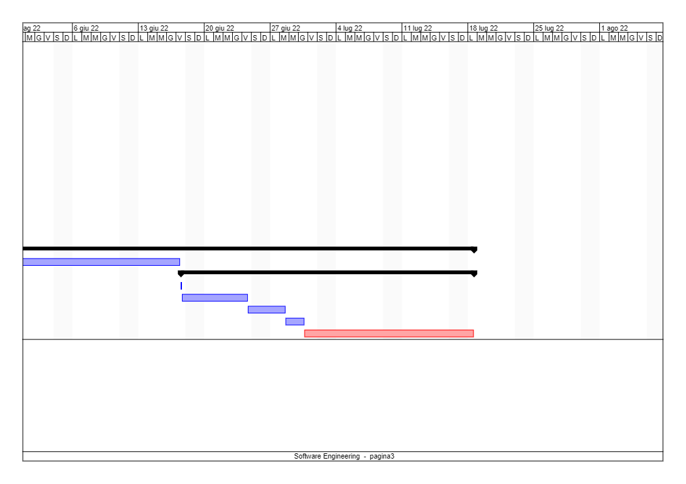

# Project Estimation  

Date: 8 april 2022

Version: 1.3

# Estimation approach
Consider the EZWH  project as described in YOUR requirement document, assume that you are going to develop the project INDEPENDENT of the deadlines of the course
# Estimate by size
### 
|             | Estimate                        |             
| ----------- | ------------------------------- |  
| NC =  Estimated number of classes to be developed   | 20 |             
|  A = Estimated average size per class, in LOC       | 100 | 
| S = Estimated size of project, in LOC (= NC * A) | 2000 |
| E = Estimated effort, in person hours (here use productivity 10 LOC per person hour)  | 200 |   
| C = Estimated cost, in euro (here use 1 person hour cost = 30 euro) | 6000 | 
| Estimated calendar time, in calendar weeks (Assume team of 4 people, 8 hours per day, 5 days per week ) | 6.1 days, 1.2 weeks |

# Estimate by product decomposition
### 
|         component name    | Estimated effort (person hours)   |             
| ----------- | ------------------------------- | 
| Requirement document | 50 |
| GUI prototype | 32 |
| Design document | 60 |
| Code | 1280 (40 days * 8 hrs a day * 4 people)|
| Unit tests | 160 |
| API tests | 100 |
| Management documents | 10 |

# Estimate by activity decomposition
### 
|         Activity name    | Estimated effort (person hours)   |             
| ----------- | ------------------------------- | 
| 1. Planning | **total: 366** |
| 1.1. Investigate state of art and user needs | *total: 48*|
| 1.1.1. Review existing warehouse systems | 16 |
| 1.1.2. Understand user requirements | 32 |
| 1.2. Requirements |*total: 66*| 
| 1.2.1. Stakeholders identification | 8 |
| 1.2.2. Develop context Diagram and interfaces | 16 |
| 1.2.3. Identify stories and personas | 12 |
| 1.2.4. Identify functional and non-functional requirements | 20 | 
| 1.2.5. Develop glossary | 10 |
| 1.3. Design | *total: 252*|
| 1.3.1. Make System design | 4 |
| 1.3.2. Make Deployment diagram | 4 |
| 1.3.3. Develop GUI prototype | 32 |
| 1.3.4. Develop design document | 96 | 
| 1.4. Present requirment document | 20 |
| 1.5. Possible replanning | 96 | 
| 2. Development |**total: 1964** |
| 2.1. Coding | *total: 1280* |
| 2.2. Testing | *total: 684*|
| 2.2.1. Create test plan | 12 |
| 2.2.2. Unit testing | 160 |
| 2.2.3. Integration testing | 64 |
| 2.2.4. Acceptance testing | 64 |
| 2.2.5. Possible code corrections | 384 |

###

# Summary

Report here the results of the three estimation approaches. The estimates may differ. Discuss here the possible reasons for the difference

|             | Estimated effort                        |   Estimated duration |          
| ----------- | ------------------------------- | ---------------|
| Estimate by size | 200 person hours| 6.1 days |
| Estimate by product decomposition | 1692 person hours | 211.5 person working days (52.8 days of work considering 4 people) |
| Estimate by activity decomposition | 2330 person hours | 291.3 days (72.8 days of work considering 4 people) |

The results provided by the estimate by size are very distant from the results provided by the subsequent estimates: most likely the assigned productivity figure is not comparable with the productivity estimated by the team members.

On the contrary, the fact that in the two subsequent estimates no specific productivity values were provided, allows a calculation of the timing that is most likely closer to reality.

The amount of detail considered in the estimation can also influence the expected effort and consequently the estimated team productivity, because it allows to consider activities that weren't taken into consideration making a raw calculation (even if they should be considered). This would explain why the estimate by activity decomposition yields an higher effort value than the estimate by product decomposition.

