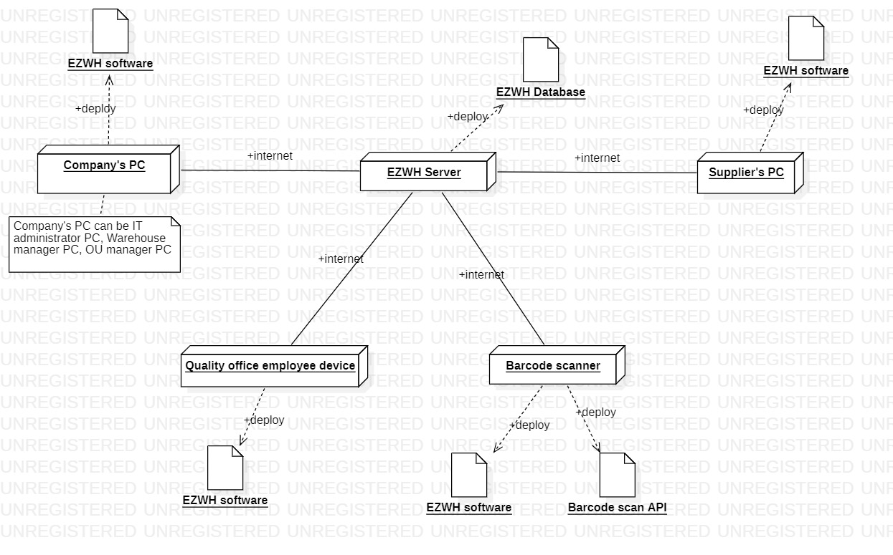

# Requirements Document

Date: 12 april 2022

Version: 1.7

| Version number | Change |
| ----------------- |:-----------|
| 1.0 | Stakeholders, Context diagram, Stories and personas |
| 1.1 | Stories and personas completed | 
| 1.2 | Functional requirements added |
| 1.3 | Non functional requirements added |
| 1.4 | Use cases added |
| 1.5 | Scenarios added per use case, Use case diagram |
| 1.6 | Glossary, System design, Deployment diagram |
| 1.7 | Revision and corrections |

# Contents

- [Informal description](#informal-description)
- [Stakeholders](#stakeholders)
- [Context Diagram and interfaces](#context-diagram-and-interfaces)
    + [Context Diagram](#context-diagram)
    + [Interfaces](#interfaces)

- [Stories and personas](#stories-and-personas)
- [Functional and non functional requirements](#functional-and-non-functional-requirements)
    + [Functional Requirements](#functional-requirements)
    + [Non functional requirements](#non-functional-requirements)
- [Use case diagram and use cases](#use-case-diagram-and-use-cases)
    + [Use case diagram](#use-case-diagram)
    + [Use cases](#use-cases)
        + [Relevant scenarios](#relevant-scenarios)
- [Glossary](#glossary)
- [System design](#system-design)
- [Deployment diagram](#deployment-diagram)

# Informal description

Medium companies and retailers need a simple application to manage the relationship with suppliers and the inventory of
physical items stocked in a physical warehouse. The warehouse is supervised by a manager, who supervises the
availability of items. When a certain item is in short supply, the manager issues an order to a supplier. In general the
same item can be purchased by many suppliers. The warehouse keeps a list of possible suppliers per item.

After some time the items ordered to a supplier are received. The items must be quality checked and stored in specific
positions in the warehouse. The quality check is performed by specific roles (quality office), who apply specific tests
for item (different items are tested differently). Possibly the tests are not made at all, or made randomly on some of
the items received. If an item does not pass a quality test it may be rejected and sent back to the supplier.

Storage of items in the warehouse must take into account the availability of physical space in the warehouse. Further
the position of items must be traced to guide later recollection of them.

The warehouse is part of a company. Other organizational units (OU) of the company may ask for items in the warehouse.
This is implemented via internal orders, received by the warehouse. Upon reception of an internal order the warehouse
must collect the requested item(s), prepare them and deliver them to a pick up area. When the item is collected by the
other OU the internal order is completed.

EZWH (EaSy WareHouse) is a software application to support the management of a warehouse.

# Stakeholders

| Stakeholder name  | Description | 
| ----------------- |:-----------|
|   Company                       |    Entity requiring EZWH services and investing on the project         |
|   Warehouse                     |    Physical space where the items are stocked         |
|   Supplier                      |    Provider of products for the company         |
|   Warehouse manager             |    Role managing the procurement (requests for orders, management of the received items) and managing the warehouse clerks         |
|    Warehouse clerk               |    Worker of the warehouse involved in stocking and collecting items, and managing the delivery of the items to a pick up area for internal orders          |
|   Quality office employee       |    Checks the received items         |
|   OU employee                   |    Representative of a department (ex. production, purchase, accounting, finance office ecc..) of the company (OU = Organizational Unit)         |
|   Customer                      |    The final consumer of the products offered by the company         |
|   IT administrator              |    A computer person in charge of solving software issues within the system and managing the account creation.         |
|   Barcode scanner               |    Technology allowing an automatic scanning of the barcodes of items stocked in the warehouse |
|   Barcode scan API              |    Service enabling a communication between EZWH software and barcode scanner functionalities |
|   Competitors                   |    Other warehouse management systems         | 

# Context Diagram and interfaces

## Context Diagram

## Interfaces

| Actor | Logical Interface | Physical Interface  |
| ------------- |:-------------|:-----|
|   Warehouse manager     | Graphical User Intarface  | Intranet (HTTP + JSON) |
|   Warehouse clerk       | Graphical User Intarface, Barcode Scanner | Laser Beam, Intranet (HTTP + JSON) |
|   Supplier    | Graphical User Interface | Internet (HTTP + JSON)  |
|   Quality office employee     | Graphical user interface | Intranet (HTTP+JSON)  |
|   OU employee     | Graphical user interface | Intranet (HTTP+JSON) |
|   IT administrator     | Graphical user interface | Intranet (HTTP+JSON) |
|   Barcode scan API | API for converting scanned barcodes into numeric codes and to transfer them to EZWH software | Internet connection |

# Stories and personas

| Persona | Story |
| ------------- |:-------------|
|  Massimo, 40 years old, Warehouse manager for a local retail company, with 10 years of experience | The company has always managed every warehouse related process in manual way, but lately the amount of orders from the customers increased exponentially, and it has become impossible to control the flow of incoming and outgoing products. I feel the need for a technological transformation to handle in an semi-automatic way the inbound and outbound logistics. Furthermore last week I spilled my green tea on the document book containing last semester's orders and i had to write everything again. It would be so nice to have a digital history of our orders, maybe with a backup system to handle "tea related" and other problems|
| Catalina, 63 years old, Warehouse manager that just wants to retire | When i was younger they called me IronMem-ory because i could remember every supplier's catalogue, name and phone number. But today the number of suppliers and data related to them is growing (as my age). I would like to have a sort of digital list of suppliers associated to the items they provide us, but it should be something easy to use. |
| Franco, 38 years old, Warehouse clerk, recently hired with previous experience as WH clerk at a very large Company | The company I worked in before was very large and technologically advanced, but now I'm struggling to adapt to this new manual management style. Finding things is too diffucult and finding the right place to stock things even more. I whish there was a warehouse management system suitable also for medium companies to help me in my daily work.|
| Mariangela, 34 years old, quality office employee with 4 years of experience | Since i started, the process of quality check has always been the same. We randomly select some products, check their compliance and then the boring process of paperwork and burocracy starts: if the product is not compliant i have to send an email to the warehouse manager, send a rejection letter to our supplier, fill a quality check record and a lot other repetitive jobs that i am sure could be done by an automatic tool. |
| Andrea, 41 years old, production office Manager for a manufacturing company | Whenever my department needs new items we have to formally make an order to the warehouse, either by email or sending a letter. Our system is old, messy and completely inefficient. I believe that the company can really benefit from a digital system that would speed up this mechanism and also make orders visible from all departments of the company in a synchronized way.|

# Functional and non functional requirements

## Functional Requirements

 <table border = "2">
			<tr><th>Requirement ID</th><th>Description</th><th>Sub-requirement ID</th><th>Description</th>
            <tr><td rowspan = "2" >FR 1</td><td rowspan = "2">Company registration</td><td>FR 1.1</td><td>Insert company data</td></tr>
            <tr><td>FR 1.2</td><td>IT administrator account creation</td></tr>
            <tr><td rowspan = "1" >FR 2</td><td rowspan = "1">User creation by IT administrator</td><td></td><td></td></tr>
            <tr><td rowspan = "2" >FR 3</td><td rowspan = "2">Setup of warehouse space and pick-up areas</td><td>FR 3.1</td><td>Set number of blocks</td></tr>
            <tr><td>FR 3.2</td><td>Add pick-up area name</td></tr>
            <tr><td rowspan = "1" >FR 4</td><td rowspan = "1">View item inventory in warehouse</td>
            <td>FR 4.1</td><td>Show list of items and quantities, with threshold</td></tr>
             <tr><td rowspan = "1" >FR 5</td><td rowspan = "1">Login</td><td></td><td></td></tr>
            <tr><td rowspan = "1" >FR 6</td><td rowspan = "1">Logout</td><td></td><td></td></tr>
            <tr><td rowspan = "7" >FR 7</td><td rowspan = "7">External order management</td><td>FR 7.1</td><td>Show items under threshold</td></tr>
            <tr><td>FR 7.2</td><td>Show specific supplier catalogue</td></tr>
            <tr><td>FR 7.3</td><td>Show list of suppliers providing a selected item</td></tr>
            <tr><td>FR 7.4</td><td>Add item to order</td></tr>
            <tr><td>FR 7.5</td><td>Show order recap</td></tr>
            <tr><td>FR 7.6</td><td>Issue order</td></tr>
            <tr><td>FR 7.7</td><td>Show history of orders</td></tr>
            <tr><td rowspan = "9" >FR 8</td><td rowspan = "9">Internal order issuing</td><td>FR 8.1</td><td>Show list of items and quantities</td></tr>
            <tr><td>FR 8.2</td><td>Select item and quantity</td></tr>
            <tr><td>FR 8.3</td><td>Add item to internal order</td></tr>
            <tr><td>FR 8.4</td><td>Modify quantity</td></tr>
            <tr><td>FR 8.5</td><td>Delete item from internal order</td></tr>
            <tr><td>FR 8.6</td><td>Select preferred pick-up area</td></tr>
            <tr><td>FR 8.7</td><td>Show internal order recap</td></tr>
            <tr><td>FR 8.8</td><td>Issue internal order</td></tr>
            <tr><td>FR 8.9</td><td>Show history of internal orders</td></tr>
            <tr><td rowspan = "2" >FR 9</td><td rowspan = "2">Internal order reception (by warehouse)</td><td>FR 9.1</td><td>Insert expected delivery date</td></tr>
            <tr><td>FR 9.2</td><td>Send expected delivery date associated to the order</td></tr>           
            <tr><td rowspan = "3" >FR 10</td><td rowspan = "3">Quality check management</td><td>FR 10.1</td><td>Show list of not-verified items</td></tr>
            <tr><td>FR 10.2</td><td>Select items to check</td></tr>
            <tr><td>FR 10.3</td><td>Produce quality check result</td></tr>
            <tr><td rowspan = "2" >FR 11</td><td rowspan = "2">Item placement management</td><td>FR 11.1</td><td>Calculate residual space</td></tr>
            <tr><td>FR 11.2</td><td>Choose a block to contain the item</td></tr>
            <tr><td rowspan = "1" >FR 12</td><td rowspan = "1">Supplier's catalogue management</td><td>FR 12.1</td><td>Update catalogue</td></tr>
        </table>

## Non Functional Requirements

| ID        | Type (efficiency, reliability, ..)           | Description  | Refers to |
| ------------- |:-------------:| :-----|:-----|
|  NFR1     | Usability  | Any employee or manager should be able to use EZWH with 8 hrs (1 work day) of training | FR3, FR7, FR8, FR9, FR10, FR11 |
|  NFR2     | Efficiency | The software should guarantee a short response time for all the fundamental functions (orders, warehouse space management, quality check) and should provide a not annoying user experience (RT < 1 sec)   | FR3, FR7, FR8, FR9, FR10, FR11 |
|  NFR3     | Reliability | Number of crashes per month < 4  Number of wrong informations displayed < 1%  | whole system |
|  NFR4     | Security | - The information in the software must splitted in function of the roles and showed only to the proper user - Access must be granted only to authorized users - Protection from malitious access | FR2, FR5 | 

# Use case diagram and use cases

## Use case diagram

## Use cases and scenarios

### Use case 1, UC1 - Company registration

| Actors Involved        | IT administrator |
| ------------- |:-------------| 
|  Precondition     | Software installed |
|  Post condition     | Company and IT administrator registered into the system |
|  Nominal Scenario     | The IT administrator registers the company in the system and creates their own profile |
|  Variants     |  |
|  Exceptions     | Missing data in mandatory fields, wrong data |

### Scenario 1.1

| Scenario 1.1 | Company registration |
| ------------- |:-------------| 
|  Precondition     |Software installed |
|  Post condition     | Company and IT administrator registered into the system |
| Step#        | Description  |
|  1     | The application is opened for the first time |  
|  2     | All the required fields are inserted |
|  3     | The IT administrator account is created inserting all credentials for the account |
|  4     | A recap of the information inserted appears on the screen and the Company and IT Administrator account are created |

### Use case 2, UC2 - User profile creation

| Actors Involved        | IT administrator |
| ------------- |:-------------| 
|  Precondition     | Company and IT administrator registered into the system |
|  Post condition     | User profile created |
|  Nominal Scenario     | The IT administrator creates a profile for every new user/employee  |
|  Variants     |  |
|  Exceptions     | User already existent, missing data in mandatory fields, wrong data |

### Scenario 2.1

| Scenario 2.1 | User profile creation |
| ------------- |:-------------| 
|  Precondition     | Company and IT administrator registered into the system and IT administrator logged in|
|  Post condition     | User profile created |
| Step#        | Description  |
|  1     | The IT administrator fills all fields to create a new employee account, Login ID is autogenerated  |  
|  2     | The IT administrator confirms the information |

### Use case 3, UC3 - Setup of warehouse space and pick-up areas

| Actors Involved        | Warehouse manager |
| ------------- |:-------------| 
|  Precondition     | Warehouse manager account created |
|  Post condition     |  1. Warehouse block added   2. Pick-up area set or modified |
|  Nominal Scenario     | 1. The warehouse manager defines the dimension of the area in terms of blocks  2. Define a pick-up area |
|  Variants     | |
|  Exceptions     | Pick-up area already existing |

### Scenario 3.1

| Scenario 3.1 | Add new block |
| ------------- |:-------------| 
|  Precondition     | Warehouse manager account created |
|  Post condition     | Warehouse space created  |
| Step#        | Description |
|  1     | See the list of blocks already existing and their residual space|  
|  2     | Add data of the block to be inserted to create new block |
|  3     | New Block is added |

### Scenario 3.2

| Scenario 3.2 | Add new pick-up area |
| ------------- |:-------------| 
|  Precondition     | Warehouse manager account created |
|  Post condition     | Warehouse space created  |
| Step#        | Description |
|  1     | See the list of pick-up areas already existing and their coordinates|  
|  2     | Add data of the pick-up area to be inserted to create new pick-up area |
|  3     | New pick-up area is added |

### Use case 4, UC4 - Show item inventory in warehouse

| Actors Involved        | Warehouse manager |
| ------------- |:-------------| 
|  Precondition     | Warehouse space created, Warehouse Manager account created |
|  Post condition     | List of items is shown | 
|  Nominal Scenario     | The inventory is displayed |
|  Variants     | The user searches for a specific item with the search bar |
|  Exceptions     |  |

### Scenario 4.1

| Scenario 4.1 | Display Inventory |
| ------------- |:-------------| 
|  Precondition     | Warehouse space created, Warehouse manager account created  |
|  Post condition     | The inventory is displayed|
| Step#        | Description |
|  1     | The warehouse manager sees the inventory and every item's useful information |  

### Scenario 4.2

| Scenario 4.2 | Display specific item |
| ------------- |:-------------| 
|  Precondition     | Warehouse space created, Warehouse manager account created  |
|  Post condition     | The item is displayed|
| Step#        | Description |
|  1     | The warehouse manager searches for a specific item | 
|  2     | The item, if existing, is displayed with its useful information | 

### Use case 5, UC5 - Login

| Actors Involved        | Warehouse manager, Supplier, Quality office employee, Warehouse clerk, OU employee, IT administrator |
| ------------- |:-------------| 
|  Precondition     | User account exists |
|  Post condition     | User is authenticated and authorized | 
|  Nominal Scenario     | User inserts his credentials  |
|  Variants     | |
|  Exceptions     |  Incorrect credentials |

### Scenario 5.1

| Scenario 5.1 | Login with correct credentials |
| ------------- |:-------------| 
|  Precondition     | User account exists  |
|  Post condition     | User is authenticated and authorized  |
| Step#        | Description |
|  1     | The user inserts their credentials | 
|  2     | The user confirms their data | 
|  3     | The user is anthenticated and can enter their account area |

### Scenario 5.2

| Scenario 5.2 | Wrong credentials |
| ------------- |:-------------| 
|  Precondition     | User account exists  |
|  Post condition     | User is not authenticated and authorized  |
| Step#        | Description |
|  1     | The user inserts their credentials | 
|  2     | The user confirms their data but it is wrong| 
|  3     | The user is not anthenticated by the application |
|  4     | The user can try again or can contact the IT administrator for help |

### Use case 6, UC6 - Logout

| Actors Involved        | Warehouse manager, Supplier, Quality office employee, Warehouse clerk, OU employee, IT administrator  |
| ------------- |:-------------| 
|  Precondition     | User is authenticated and authorized |
|  Post condition     | User is logged out | 
|  Nominal Scenario     | User presses log out button |
|  Variants     | |
|  Exceptions     |  |

### Scenario 6.1

| Scenario 6.1 | Logout  |
| ------------- |:-------------| 
|  Precondition     | User is authenticated and authorized |
|  Post condition     | User is logged out | 
| Step#        | Description |
|  1     | The user presses the log-out button |  
|  2     | The user is logged out |
|  3     | The user is brought to the page for a new login |

### Use case 7, UC7 - External order management

| Actors Involved        | Warehouse manager |
| ------------- |:-------------| 
|  Precondition     | User authenticated and authorized for the external order area |
|  Post condition     | External order is sent | 
|  Nominal Scenario     | The items are selected and added to the cart, then the order is issued |
|  Variants     | 1.1 Show list of all available items   1.2 Show specific supplier's catalogue   2.1 Delete previously selected item   2.2. Modify number of requested items   3. show order history |
|  Exceptions     | Number of items needed is higher than supplier's availability |

### Scenario 7.1

| Scenario 7.1 | The order is issued |
| ------------- |:-------------| 
|  Precondition     | Warehouse manager authenticated and authorized for the external order area |
|  Post condition     | External order is sent | 
| Step#        | Description |
|  1     | The list of available items from the suppliers is shown |  
|  2     | An item is added to the cart         2.1 An item is added from the list of items         2.2 An item is added selecting from the catalogue of a specific supplier|
|  3     | The cart is reviewed |
|  3     | The order is confirmed and issued |

### Scenario 7.2

| Scenario 7.2 | The cart is modified by deleting items before issuing order|
| ------------- |:-------------| 
|  Precondition     | Warehouse manager authenticated and authorized for the external order area |
|  Post condition     | Some items are deleted from the cart and order is issued | 
| Step#        | Description |
|  1     | The list of available items from the suppliers is shown |  
|  2     | An item is added to the cart         2.1 An item is added from the list of items         2.2 An item is added selecting from the catalogue of a specific supplier|
|  3     | The cart is reviewed |
|  4     | Some items are removed from the cart |
|  5     | The order is confirmed and issued |

### Scenario 7.3

| Scenario 7.3 | The cart is modified in the items' quantities before issuing order |
| ------------- |:-------------| 
|  Precondition     | Warehouse manager authenticated and authorized for the external order area |
|  Post condition     | Item quantities are modified in the cart and order is issued | 
| Step#        | Description |
|  1     | The list of available items from the suppliers is shown |  
|  2     | An item is added to the cart         2.1 An item is added from the list of items         2.2 An item is added selecting from the catalogue of a specific supplier|
|  3     | The cart is reviewed |
|  4     | Some item quantities are modified from the cart |
|  5     | The order is confirmed and issued |

### Scenario 7.3

| Scenario 7.3 | History of orders is shown |
| ------------- |:-------------| 
|  Precondition     | Warehouse manager authenticated and authorized for the external order area, previous orders have been issued |
|  Post condition     | List of previous orders is shown | 
| Step#        | Description |
|  1     | List of previously issued orders is shown with their relevant information|  

### Use case 8, UC8 - Internal order issuing

| Actors Involved        | OU employee, Quality office employee |
| ------------- |:-------------| 
|  Precondition     | User authenticated and authorized for the internal order area |
|  Post condition     | Internal order is sent | 
|  Nominal Scenario     | Some items are selected from the inventory, the pick-up area is selected and the order is issued |
|  Variants     | Modify number of requested items, history of orders is shown |
|  Exceptions     |  |

### Scenario 8.1

| Scenario 8.1 | Issuing an internal order |
| ------------- |:-------------| 
|  Precondition     |  User authenticated and authorized for the internal order area |
|  Post condition     | Internal order is sent  | 
| Step#        | Description |
|  1     | List of items in inventory is shown|  
|  2     | A quantity of items is added to the order |
|  3     | A pick-up area is selected from the list of pick-up areas available |
|  4     | The order is confirmed and issued |

### Scenario 8.2

| Scenario 8.2 | Issuing an internal order after modifying quantity of an item |
| ------------- |:-------------| 
|  Precondition     |  User authenticated and authorized for the internal order area |
|  Post condition     | Internal order is sent  | 
| Step#        | Description |
|  1     | List of items in inventory is shown|  
|  2     | A quantity of items is added to the order |
|  3     | A selected quantity is modified (or brought to zero) |
|  4     | A pick-up area is selected from the list of pick-up areas available |
|  5     | The order is confirmed and issued |

### Scenario 8.3

| Scenario 8.3 | History of previous orders is shown |
| ------------- |:-------------| 
|  Precondition     |  User authenticated and authorized for the internal order area, previous orders have been issued |
|  Post condition     | History of orders is shown | 
| Step#        | Description |
|  1     | List of previously issued orders is shown with their relevant information |

### Use case 9, UC9 - Internal order reception (by warehouse)

| Actors Involved        | Warehouse manager |
| ------------- |:-------------| 
|  Precondition     | Internal order is sent from a specific OU employee |
|  Post condition     | The internal order is managed | 
|  Nominal Scenario     | The warehouse manager chooses an order from the list of incoming orders and sets an estimated delivery date for it |
|  Variants     |  |
|  Exceptions     | 2.1. The selected delivery date is inconsistent (a past date) |

### Scenario 9.1

| Scenario 9.1 | Management of internal incoming order|
| ------------- |:-------------| 
|  Precondition     |  User authenticated and authorized for the internal order area |
|  Post condition     | Internal order is sent  | 
| Step#        | Description |
|  1     | The warehouse manager checks the list of incoming internal orders|  
|  2     | The warehouse manager inserts an expected delivery date associated to the order|
|  3     | The warehouse manager accepts the internal order |

### Use case 10, UC10 - Quality check management

| Actors Involved        | Quality office employee |
| ------------- |:-------------| 
|  Precondition     | Some items in the warehouse are not quality checked |
|  Post condition     | Some items are reviewed | 
|  Nominal Scenario     | A quality check employee selects some items to be checked and gives a review to them.  |
|  Variants     | The list of previously accepted or rejected items can be shown  |
|  Exceptions     |  |

### Scenario 10.1

| Scenario 10.1 | Quality check of an item |
| ------------- |:-------------| 
|  Precondition     |  Some items in the warehouse are not quality checked |
|  Post condition     | Some items are quality checked  | 
| Step#        | Description |
|  1     | A quality check employee sees the list of the unchecked items|  
|  2     | They select an item for the checking process|
|  3     | The quality check employee gives a positive or negative quality check result for the item |

### Scenario 10.2

| Scenario 10.2 | List display of accepted items |
| ------------- |:-------------| 
|  Precondition     |  Some items in the warehouse have been quality checked previously |
|  Post condition     | List of accepted items is displayed  | 
| Step#        | Description |
|  1     | A quality check employee sees the list of already accepted items|  

### Scenario 10.3

| Scenario 10.3 | List display of rejected items |
| ------------- |:-------------| 
|  Precondition     |  Some items in the warehouse have been quality checked previously |
|  Post condition     | List of rejected items is displayed  | 
| Step#        | Description |
|  1     | A quality check employee sees the list of already rejected items|  

### Use case 11, UC11 - Item placement management

| Actors Involved        | Warehouse Clerk, Barcode scanner |
| ------------- |:-------------| 
|  Precondition     | An item is ordered and received and it is not yet placed in a warehouse block |
|  Post condition     | The item is placed in a warehouse block|  
|  Nominal Scenario     | he warehouse clerk scans a product and the application returns an optimal block for the item to be placed in |
|  Variants     |  Warehouse clerk inserts manually the code of the product|
|  Exceptions     |  There is not enough space left in any block of the warehouse  |

### Scenario 11.1

| Scenario 11.1 | Item scanning and positioning |
| ------------- |:-------------| 
|  Precondition     |  An item is ordered and received and it is not yet placed in a warehouse block  |
|  Post condition     | The item is placed in a warehouse block  | 
| Step#        | Description |
|  1     | The warehouse clerk is given an item to scan|  
|  2     | An optimal block for the item to be positioned in is provided|

### Scenario 11.2

| Scenario 11.2 | Manual insertion of item code and positioning |
| ------------- |:-------------| 
|  Precondition     |  An item is ordered and received and it is not yet placed in a warehouse block  |
|  Post condition     | The item is placed in a warehouse block  | 
| Step#        | Description |
|  1     | The warehouse clerk is given an item to scan but the scanner fails to read the bar code|  
|  2     | The warehouse clerk manually writes the item code into the system|
|  3     | An optimal block for the item to be positioned in is provided|

### Scenario 11.3

| Scenario 11.3 | The item cannot be placed |
| ------------- |:-------------| 
|  Precondition     |  An item is ordered and received and it is not yet placed in a warehouse block  |
|  Post condition     | The item is not placed in a block- No space available in any block | 
| Step#        | Description |
|  1     | The warehouse clerk is given an item to scan|  
|  2     | An optimal block with enough space for the item to be positioned is not found|

### Use case 12, UC12 - Supplier's catalogue management

| Actors Involved        | Supplier|
| ------------- |:-------------| 
|  Precondition     | A catalogue exists and the supplier is registered in the application|
|  Post condition     | The catalogue is updated | 
|  Nominal Scenario     | Supplier modifies item inserting all necessary information|
|  Variants     | 1. Supplier views existing catalogue   2. Supplier deletes item from catalogue   3. Supplier modifies information of existing item in their catalogue |
|  Exceptions     |  |

### Scenario 12.1

| Scenario 12.1 | Supplier adds to their catalogue |
| ------------- |:-------------| 
|  Precondition     |  A catalogue exists and the supplier is registered in the application  |
|  Post condition     | The catalogue is updated with new items  | 
| Step#        | Description |
|  1     | Supplier adds item inserting all necessary information|  

### Scenario 12.2

| Scenario 12.2 | Supplier adds to their catalogue |
| ------------- |:-------------| 
|  Precondition     |  A catalogue exists and the supplier is registered in the application  |
|  Post condition     | An item of the catalogue is updated  | 
| Step#        | Description |
|  1     | Supplier updates an item information|  

### Scenario 12.3

| Scenario 12.2 | Supplier removes item from their catalogue |
| ------------- |:-------------| 
|  Precondition     |  A catalogue exists and the supplier is registered in the application  |
|  Post condition     | An item of the catalogue is deleted  | 
| Step#        | Description |
|  1     | Supplier deletes an item entry from their catalogue| 

# Glossary

# System Design

# Deployment Diagram

