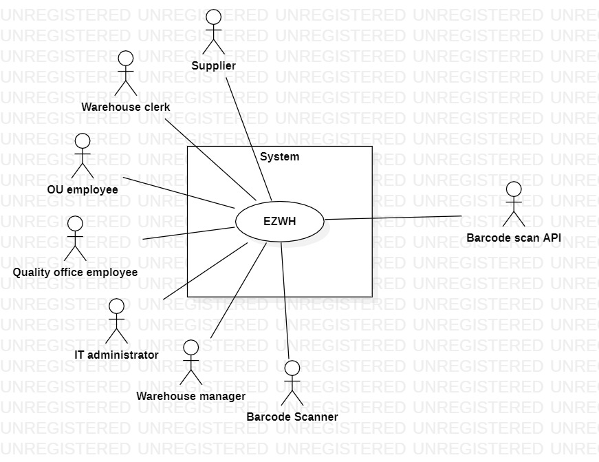

 #Requirements Document 

Date: 22 march 2022

Version: 0.0

 
| Version number | Change |
| ----------------- |:-----------|
| | | 

# Contents

- [Informal description](#informal-description)
- [Stakeholders](#stakeholders)
- [Context Diagram and interfaces](#context-diagram-and-interfaces)
	+ [Context Diagram](#context-diagram)
	+ [Interfaces](#interfaces) 
	
- [Stories and personas](#stories-and-personas)
- [Functional and non functional requirements](#functional-and-non-functional-requirements)
	+ [Functional Requirements](#functional-requirements)
	+ [Non functional requirements](#non-functional-requirements)
- [Use case diagram and use cases](#use-case-diagram-and-use-cases)
	+ [Use case diagram](#use-case-diagram)
	+ [Use cases](#use-cases)
    	+ [Relevant scenarios](#relevant-scenarios)
- [Glossary](#glossary)
- [System design](#system-design)
- [Deployment diagram](#deployment-diagram)

# Informal description
Medium companies and retailers need a simple application to manage the relationship with suppliers and the inventory of physical items stocked in a physical warehouse. 
The warehouse is supervised by a manager, who supervises the availability of items. When a certain item is in short supply, the manager issues an order to a supplier. In general the same item can be purchased by many suppliers. The warehouse keeps a list of possible suppliers per item. 

After some time the items ordered to a supplier are received. The items must be quality checked and stored in specific positions in the warehouse. The quality check is performed by specific roles (quality office), who apply specific tests for item (different items are tested differently). Possibly the tests are not made at all, or made randomly on some of the items received. If an item does not pass a quality test it may be rejected and sent back to the supplier. 

Storage of items in the warehouse must take into account the availability of physical space in the warehouse. Further the position of items must be traced to guide later recollection of them.

The warehouse is part of a company. Other organizational units (OU) of the company may ask for items in the warehouse. This is implemented via internal orders, received by the warehouse. Upon reception of an internal order the warehouse must collect the requested item(s), prepare them and deliver them to a pick up area. When the item is collected by the other OU the internal order is completed. 

EZWH (EaSy WareHouse) is a software application to support the management of a warehouse.

# Stakeholders

| Stakeholder name  | Description | 
| ----------------- |:-----------:|
|   Company                       |    Entity requiring EZWH services and investing on the project         |
|   Warehouse                     |    Physical space where the items are stocked         |
|   Supplier                      |    Provider of products for the company         |
|   Warehouse manager             |    Role managing the procurement (requests for orders, management of the received items) and managing the warehouse clerks         |
|	Warehouse clerk               |    Worker of the warehouse involved in stocking and collecting items          |
|   Quality office employee       |    Checks the received items         |
|   OU employee                   |    Representative of a department (ex. production, purchase, accounting, finance office ecc..) of the company (OU = Organizational Unit)         |
|   Customer                      |    The final consumer of the products realized by the company         |
|   IT administrator              |    A computer person in charge of solving software issues within the system         |
|   Delivery operator             |    Managing the delivery of the items to a pick up area for internal orders          |
|   Competitors                   |    Other warehouse management systems         | 

# Context Diagram and interfaces

## Context Diagram
\<Define here Context diagram using UML use case diagram>

\<actors are a subset of stakeholders>

## Interfaces
\<describe here each interface in the context diagram>

\<GUIs will be described graphically in a separate document>

| Actor | Logical Interface | Physical Interface  |
| ------------- |:-------------:| -----:|
|   Warehouse manager     | Graphical User Intarface  | Intranet (HTTP + JSON) |
|   Warehouse clerk       | Graphical User Intarface, Barcode Reader | Laser Beam, Intranet (HTTP + JSON) |
|   Supplier    | Graphical User Interface | Internet (HTTP + JSON)  |
|   Quality office employee     | Graphical user interface | Intranet (HTTP+JSON)  |
|   OU employee     | Graphical user interface | Intranet (HTTP+JSON) |

# Stories and personas
\<A Persona is a realistic impersonation of an actor. Define here a few personas and describe in plain text how a persona interacts with the system>

\<Persona is-an-instance-of actor>

\<stories will be formalized later as scenarios in use cases>

| Persona | Story |
| ------------- |:-------------:|
|  Massimo, 40 years old, Warehouse manager for a local retail company, with 10 years of experience | The company has always managed every warehouse related process in manual way, but lately the amount of orders from the customers increased exponentially, and it has become impossible to control the flow of incoming and outgoing products. I feel the need for a technological transformation to handle in an semi-automatic way the inbound and outbound logistics. Furthermore last week I spilled my green tea on the document book containing last semester's orders and i had to write everything again. It would be so nice to have a digital history of our orders, maybe with a backup system to handle "tea related" and other problems|
| Catalina, 63 years old, Warehouse manager that just wants to retire | When i was younger they called me IronMem-ory because i could remember every supplier's catalogue, name and phone number. But today the number of suppliers and data related to them is growing (as my age). I would like to have a sort of digital list of suppliers associated to the items they provide us, but it should be something easy to use. |
| Franco, 38 years old, Warehouse clerk, recently hired with previous experience as WH clerk at a very large Company | The company I worked in before was very large and technologically advanced, but now I'm struggling to adapt to this new manual management style. Finding things is too diffucult and finding the right place to stock things even more. I whish there was a warehouse management system suitable also for medium companies to help me in my daily work.|
| Mariangela, 34 years old, quality office employee with 4 years of experience | Since i started, the process of quality check has always been the same. We randomly select some products, check their compliance and then the boring process of paperwork and burocracy starts: if the product is not compliant i have to send an email to the warehouse manager, send a rejection letter to our supplier, fill a quality check record and a lot other repetitive jobs that i am sure could be done by an automatic tool. |
| Andrea, 41 years old, production office Manager for a manufacturing company | Whenever my department needs new items we have to formally make an order to the warehouse, but our system is old, messy and completely inefficient. digitalize system, database, centralized. ##### MODIFICA#### |

# Functional and non functional requirements

## Functional Requirements

\<In the form DO SOMETHING, or VERB NOUN, describe high level capabilities of the system>

\<they match to high level use cases>

| ID        | Description  |
| ------------- |:-------------:| 
| FR1  | Company registration | 
| FR1.1 | Insert company data |
| FR1.2 | Warehouse manager account creation |
| FR2   | Account creation (by WH manager + it administrator assistance if needed) | 
| FR2.1 | Insert user data and role |
| FR3 | Setup of Warehouse space |   
| FR3.1 | set number of blocks |  
| FR3.2 | add pick-up area name |
| FR4  | Manage items in warehouse |
| FR4.1 | Add new item instance (and minimum threshold) in warehouse |
| FR4.2 | Modify item instance |
| FR4.3 | Delete item instance |
| FR4.4 | Show list of items and quantities |
| FR4.5 | Show items under treshold (considering orders in transit) |
| FR5   | Login |
| FR6   | Logout |
| FR7   | External order management |
| FR7.1 | Show items under treshold |
| FR7.2 | Show specific supplier catalogue |
| FR7.3 | Show list of suppliers providing a selected item |
| FR7.4 | Add item to order |
| FR7.5 | Show order recap |
| FR7.5 | Issue order |
| FR7.7 | Show history of orders |
| FR8 | Internal order management |
| FR8.1 | Show list of items and quantities |
| FR8.2 | Select item and quantity |
| FR8.3 | Add item to internal order |
| FR8.4 | Modify quantity |
| FR8.5 | Delete item from internal order |
| FR8.6 | Select preferred pick-up area |
| FR8.7 | Show internal order recap |
| FR8.8 | Issue internal order |
| FR8.9 | Show history of internal orders |
| FR9   | Internal order reception (by Warehouse) |
| FR9.1 | Insert expected delivery date |
| FR9.2 | Send expected delivery date associated to the order |   
| FR10  | Quality check management |
| FR10.1 | Show list of unchecked items |
| FR10.2 | Select items to check |
| FR10.3 | Produce quality check result |
| FR11  | Item placement management |
| FR11.1 | Calculate available space |
| FR11.2 | Choose a block from the list of available blocks | 

## Non Functional Requirements

\<Describe constraints on functional requirements>

| ID        | Type (efficiency, reliability, ..)           | Description  | Refers to |
| ------------- |:-------------:| :-----:| -----:|
|  NFR1     | Usability  | Any employee or manager should be able to use EZWH with 1 day of training | FR3, FR7, FR8, FR9, FR10, FR11 |
|  NFR2     | Efficiency | The software should guarantee a short response time for all the fundamental functions (orders, warehouse space management, quality check) and should provide a not annoying user experience (RT < 1 sec)   | FR3, FR7, FR8, FR9, FR10, FR11 |
|  NFR3     | Reliability | Number of crashes per month < 4  Number of wrong informations displayed < 1%  | ????? |
|  NFR4     | Privacy | The information in the software must splitted in function of the roles and showed only to the proper user | FR2, FR5 | 

# Use case diagram and use cases

## Use case diagram
\<define here UML Use case diagram UCD summarizing all use cases, and their relationships>

\<next describe here each use case in the UCD>
### Use case 1, UC1
| Actors Involved        |  |
| ------------- |:-------------:| 
|  Precondition     | \<Boolean expression, must evaluate to true before the UC can start> |
|  Post condition     | \<Boolean expression, must evaluate to true after UC is finished> |
|  Nominal Scenario     | \<Textual description of actions executed by the UC> |
|  Variants     | \<other normal executions> |
|  Exceptions     | \<exceptions, errors > |

##### Scenario 1.1 

\<describe here scenarios instances of UC1>

\<a scenario is a sequence of steps that corresponds to a particular execution of one use case>

\<a scenario is a more formal description of a story>

\<only relevant scenarios should be described>

| Scenario 1.1 | |
| ------------- |:-------------:| 
|  Precondition     | \<Boolean expression, must evaluate to true before the scenario can start> |
|  Post condition     | \<Boolean expression, must evaluate to true after scenario is finished> |
| Step#        | Description  |
|  1     |  |  
|  2     |  |
|  ...     |  |

##### Scenario 1.2

##### Scenario 1.x

### Use case 2, UC2
..

### Use case x, UCx
..

# Glossary

\<use UML class diagram to define important terms, or concepts in the domain of the system, and their relationships> 

\<concepts are used consistently all over the document, ex in use cases, requirements etc>

# System Design
\<describe here system design>

\<must be consistent with Context diagram>

# Deployment Diagram 

\<describe here deployment diagram >

