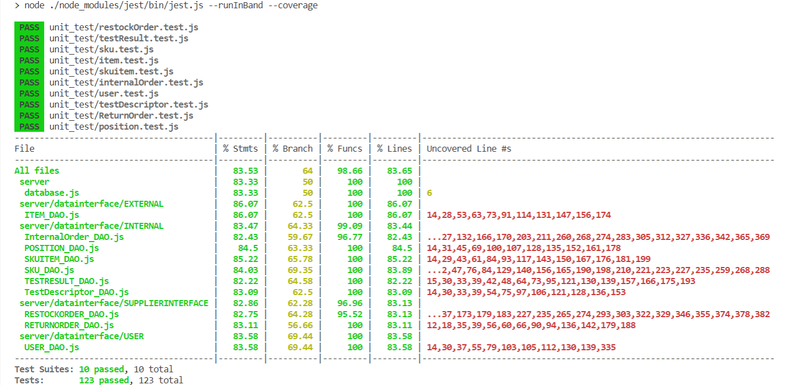

# Unit Testing Report

Date:

Version:

# Contents

- [Black Box Unit Tests](#black-box-unit-tests)

- [White Box Unit Tests](#white-box-unit-tests)

# Black Box Unit Tests

## CLASS SKUITEM
### Class *SKUITEM_DAO* - method **storeSKUItem(db, data)**

**Criteria for method *storeSKUItem(db, data)*:**
 1. SKUId existing

| Criteria | Predicate |
| -------- | --------- |
|  SKUId existing      | YES |
|  SKUId existing      | NO  |

**Boundaries**: No boundaries, only boolean predicates to test

**Combination of predicates**:

| SKUId existing | Valid / Invalid | Description of the test case | Jest test case |
|-------|-------|-------|-------|
| YES | YES | Creates a new SKUItem belonging to an existing SKU and gets the created SKUItem |Suite: "Testing storeSKUItem", Case: "SKUId existing"|
| NO | NO | Creates a new SKUItem belonging to a not existing SKU and catches a "ID not found" exception |Suite: "Testing storeSKUItem", Case: "SKUId not existing"|

### Class *SKUITEM_DAO* - method **getStoredSKUItemByRFID(db, rfid)**

**Criteria for method *getStoredSKUItemByRFID(db, rfid)*:**
 1. RFID existing

**Predicates for method *getStoredSKUItemByRFID(db, rfid)*:**

| Criteria | Predicate |
| -------- | --------- |
|  RFID existing  | YES   |
|  RFID existing  |  NO   |

**Boundaries**: No boundaries, only boolean predicates to test

**Combination of predicates**:

| RFID existing | Valid / Invalid | Description of the test case | Jest test case |
|-------|-------|-------|-------|
| YES | YES | Searches for a SKUItem whose RFID exists and should return the proper SKUItem |Suite: "Testing getStoredSKUItemByRFID", Case: "RFID existing"|
| NO | NO | Searches for a SKUItem whose RFID doesn't exist and should catch an "ID not found" exception |Suite: "Testing getAvailableStoredSkuItem", Case: "RFID not existing"|

### Class *SKUITEM_DAO* - method **getAvailableStoredSKUItem(db, id)**

**Criteria for method *getAvailableStoredSKUItem(db, id)*:**
 1. SKUId existing
 2. Available = 1 (*note*: available can never assume values which aren't 1 or 0 due to API level checks)

**Predicates for method *getAvailableStoredSKUItem(db, id)*:**

| Criteria | Predicate |
| -------- | --------- |
|  SKUId existing      | YES |
|  SKUId existing        |  NO   |
|  Available = 1 |  YES  |
|  Available = 1 |  NO   |

**Boundaries**: No boundaries, only boolean predicates to test

**Combination of predicates**:

| SKUId existing | Available | Valid / Invalid | Description of the test case | Jest test case |
|-------|-------|-------|-------|-------|
| YES | YES | YES | Creates an SKU with given SKUId, creates a SKUItem with given ID, existing SKUId, and puts Available = 1, the function should return an array with it |Suite: "Testing getAvailableStoredSkuItem", Case: "Available skuitem found"|
| YES | NO | YES | Creates an SKU with given SKUId, creates a SKUItem with given ID, existing SKUId and Available = 0, the function should return an empty array |Suite: "Testing getAvailableStoredSkuItem", Case: "No available skuitems found"|
| NO | ... | NO | Creates a SKUItem with given ID but with a non-existing SKUId (value of Available is unrelevant), the function should catch an "ID not found" exception|Suite: "Testing getAvailableStoredSkuItem", Case: "No SKUId found exception"|

### Class *SKUITEM_DAO* - method **updateSKUItem(db, rfid, data)**

**Criteria for method *updateSKUItem(db, rfid, data)*:**
 1. RFID existing

**Predicates for method *updateSKUItem(db, rfid, data)*:**

| Criteria | Predicate |
| -------- | --------- |
|  RFID existing  | YES   |
|  RFID existing  |  NO   |

**Boundaries**: No boundaries, only boolean predicates to test

**Combination of predicates**:

| RFID existing | Valid / Invalid | Description of the test case | Jest test case |
|-------|-------|-------|-------|
| YES | YES | Searches for a SKUItem whose RFID exists and should update the proper SKUItem, so by searching by id the same SKUItem it should have updated values |Suite: "Testing updateSKUItem", Case: "RFID existing"|
| NO | NO | Searches for a SKUItem whose RFID doesn't exist and should catch an "ID not found" exception |Suite: "Testing updateSKUItem", Case: "RFID not existing"|

### Class *SKUITEM_DAO* - method **deleteSKUItem(db, rfid)**
**Criteria for method *deleteSKUItem(db, rfid)*:**
 1. RFID existing

**Predicates for method *deleteSKUItem(db, rfid)*:**

| Criteria | Predicate |
| -------- | --------- |
|  RFID existing  | YES   |
|  RFID existing  |  NO   |

**Boundaries**: No boundaries, only boolean predicates to test

| RFID existing | Valid / Invalid | Description of the test case | Jest test case |
|-------|-------|-------|-------|
| YES | YES | Deletes a SKUItem whose RFID exists and searches for it in the database: an 'ID not found' exception should be catched |Suite: "Testing deleteSKUItem", Case: "RFID existing"|
| NO | NO | Tries to delete a SKUItem whose RFID doesn't exist and should catch an "ID not found" exception |Suite: "Testing deleteSKUItem", Case: "RFID not existing"|

## CLASS RESTOCKORDER

### Class *RESTOCKORDER_DAO* - method **getStoredRestockOrderById(db, id)**
**Criteria for method *getStoredRestockOrderById(db, id)*:**
 1. ROID existing

 | Criteria | Predicate |
| -------- | --------- |
|  ROID existing  | YES   |
|  ROID existing  |  NO   |

**Boundaries**: No boundaries, only boolean predicates to test

| ROID existing | Valid / Invalid | Description of the test case | Jest test case |
|-------|-------|-------|-------|
| YES | YES | Creates a restockOrder and searches for it given the specific ID: the expected result is to find the restockOrder |Suite: "Testing getStoredRestockOrderById", Case: "ROID existing"|
| NO | NO | Searches for a restockOrder whose ROID doesn't exist and should catch an "ID not found" exception |Suite: "Testing getStoredRestockOrderById", Case: "ROID not existing"|

### Class *RESTOCKORDER_DAO* - method **updateRestockOrderState(db, id, state)**
**Criteria for method *getStoredRestockOrderById(db, id)*:**
 1. ROID existing

 *Note:* State correctness tested at the API level

 | Criteria | Predicate |
| -------- | --------- |
|  ROID existing  | YES   |
|  ROID existing  |  NO   |

**Boundaries**: No boundaries, only boolean predicates to test

| ROID existing | Valid / Invalid | Description of the test case | Jest test case |
|-------|-------|-------|-------|
| YES | YES | Creates a restockOrder, updates a restockOrder given a correct ID and a proper state, expects to find the same restockOrder with the updated state |Suite: "Testing updateRestockOrderState", Case: "ROID existing"|
| NO | NO | Tries to update a restockOrder whose ROID doesn't exist and should catch an "ID not found" exception |Suite: "Testing updateRestockOrderState", Case: "ROID not existing"|

### Class *RESTOCKORDER_DAO* - method **updateRestockOrderTransportNote(db, id, transportNote)**
**Criteria for method *updateRestockOrderTransportNote(db, id, transportNote)*:**
 1. ROID existing
 2. State "DELIVERY"
 3. Transport note DeliveryDate >= restockOrder issueDate

 *Note:* State correctness tested at the API level

 | Criteria | Predicate |
| -------- | --------- |
| ROID existing  | YES   |
| ROID existing  |  NO   |
| State delivery | YES |
| State delivery | NO |
| Transport note DeliveryDate >= restockOrder issueDate | DeliveryDate < issueDate | 
| Transport note DeliveryDate >= restockOrder issueDate | DeliveryDate >= issueDate | 

**Boundaries**:

| Criteria | Boundary values |
| -------- | --------- |
| Transport note DeliveryDate >= restockOrder issueDate  | DeliveryDate = issueDate |
| Transport note DeliveryDate >= restockOrder issueDate  | DeliveryDate = new Date(-8640000000000000).toUTCString() // Tue, 20 Apr 271,822 B.C. 00:00:00 UTC |
| Transport note DeliveryDate >= restockOrder issueDate  | DeliveryDate = new Date(8640000000000000).toUTCString() // Sat, 13 Sep 275,760 00:00:00 UTC 00:00:00 UTC |

| ROID existing | State delivery | DeliveryDate >= issueDate |Valid / Invalid | Description of the test case | Jest test case |
|-------|-------|-------|-------|-------|-------|
| YES | YES | YES | YES | Creates a restockOrder, updates a restockOrder given a correct ID with a DELIVERY state, inserts a transportNote whose DeliveryDate >= issueDate (boundaries to test are deliveryDate = issueDate, and deliveryDate = maxDate): in all the cases the function expects to find the same restockOrder with a transportNote | Suite: "Testing UpdateRestockOrderTransportNote", Case: "State DELIVERY and ROID existing and DeliveryDate > IssueDate" Case: "DeliveryDate = maxDate"  Case: "DeliveryDate = issueDate"|
| YES | YES | NO | NO | Inserts a transportNote whose DeliveryDate < issueDate (boundary to test: DeliveryDate = minDate): expects to catch a 'Delivery before issue' exception |Suite: "Testing UpdateRestockOrderTransportNote", Case: "State DELIVERY and ROID existing and DeliveryDate < IssueDate" Case: "DeliveryDate = minDate"|
| YES | NO | ... | NO | Tries to insert a transportNote in a restockOrder having state != DELIVERY: expects to catch a 'Not DELIVERY state' exception |Suite: "Testing UpdateRestockOrderTransportNote", Case: "State not DELIVERY and ROID existing" |
| NO | ... | ... | NO | Tries to insert a transportNote in a non existing restockOrder: should catch an 'ID not found' exception |Suite: "Testing UpdateRestockOrderTransportNote", Case: "ROID not existing" |

## CLASS POSITION

### Class *POSITION_DAO* - method **storePosition(db, data)**

**Criteria for method *storePosition(db, data)*
 0. None

**Boundaries**: No boundaries

**Combination of predicates**:

| Valid / Invalid | Description of the test case | Jest test case |
|-------|-------|-------|
| YES | Creates new Position with the passed data and then checks its correctness |Suite: "Testing StorePosition"|

### Class *POSITION_DAO* - method **getStoredPosition(db)**
**Criteria for method *getStoredPosition(db)*:**
No criteria

**Boundaries**: No boundaries

| Valid / Invalid | Description of the test case | Jest test case |
|-------|-------|-------|
| YES | Creates a Position, calls getStoredPosition function to check if the position is correctly extracted |Suite: "Testing getStoredPosition"|

### Class *POSITION_DAO* - method **updatePosition(db, id, data)**
**Criteria for method *updatePosition(db, id, data)*:**
 1. PositionID existing

 *Note:* State correctness tested at the API level

 | Criteria | Predicate |
| -------- | --------- |
|  PositionID existing  | YES   |
|  PositionID existing  |  NO   |

**Boundaries**: No boundaries, only boolean predicates to test

| PositionID existing | Valid / Invalid | Description of the test case | Jest test case |
|-------|-------|-------|-------|
| YES | YES | Creates a Position, updates a Position given a correct positionID and proper data, expects to find the same Position with the updated data |Suite: "Testing updatePosition", Case: "Position id found"|
| NO | NO | Tries to update a Position whose PositionID doesn't exist and should catch an "ID not found" exception |Suite: "Testing updatePosition", Case: "No position id found"|

### Class *POSITION_DAO* - method **updatePositionID(db, id, data)**
**Criteria for method *updatePositionID(db, id, data)*:**
 1. Starting PositionID existing

 *Note:* State correctness tested at the API level

 | Criteria | Predicate |
| -------- | --------- |
|  PositionID existing  | YES   |
|  PositionID existing  |  NO   |

**Boundaries**: No boundaries, only boolean predicates to test

| PositionID existing | Valid / Invalid | Description of the test case | Jest test case |
|-------|-------|-------|-------|
| YES | YES | Creates a Position, updates a PositionID given a correct starting positionID and correct data, expects to find the same Position with the updated PositionID |Suite: "Testing updatePositionID", Case: "Position id found"|
| NO | NO | Tries to update an ID of Position whose starting PositionID doesn't exist and should catch an "ID not found" exception |Suite: "Testing updatePositionID", Case: "No position id found"|

### Class *POSITION_DAO* - method **deletePosition(db, id)**
**Criteria for method *deletePosition(db, id)*:**
 1.  PositionID existing

 *Note:* State correctness tested at the API level

 | Criteria | Predicate |
| -------- | --------- |
|  PositionID existing  | YES   |
|  PositionID existing  |  NO   |

**Boundaries**: No boundaries, only boolean predicates to test

| PositionID existing | Valid / Invalid | Description of the test case | Jest test case |
|-------|-------|-------|-------|
| YES | YES | Creates a Position, deletes the Position given its ID, expects to catch an "ID not found" exception  searching for the deleted position in the database  |Suite: "Testing deletePosition", Case: "Position id found"|
| NO | NO | Tries to delete a Position whose PositionID doesn't exist and should catch an "ID not found" exception |Suite: "Testing Testing deletePosition", Case: "No position id found"|

## CLASS SKU

### Class *SKU_DAO* - method **updateSKU(db, id, data)**
**Criteria for method *updateSKU(db, id, data)*:**
 1.  SKU id existing
 2. Position is null
 3. Position maximum capacity reached
 4. Position ID is not found

 *Note:* State correctness tested at the API level

 | Criteria | Predicate |
| -------- | --------- |
|  SKU id existing  | YES   |
|  SKU id existing  |  NO   |
|  Position is null | YES   |
|  Position is null  |  NO   |
|  Position maximum capacity reached  | YES   |
|  Position maximum capacity reached  |  NO   |
|  Position ID  found  | YES   |
|  Position ID  found  |  NO   |

**Boundaries**: No boundaries, only boolean predicates to test

| SKU id existing |Position is null |Position maximum capacity reached | Position ID found | Valid / Invalid | Description of the test case | Jest test case |
|-------|-------|-------|-------|-------|-------|-------|
| YES | YES | - | - | YES | Creates an SKU, updates the SKU given its ID,  expects to find in the database the SKU with the updated data  |Suite: "Testing updateSKU", Case: "SKU id found, position is null"|
| YES | NO | NO | YES | YES | Creates an SKU, updates the SKU given its ID and updates the values of OccupiedWeight/Volume in the position of the SKU,  expects to find in the database the SKU with the updated data  |Suite: "Testing updateSKU", Case: "SKU id found, position is NOT null, Maximum position capacity NOT exceeded"|
| YES | NO | YES | YES | NO | Creates an SKU, tries to update the SKU given its ID but cannot update the values of OccupiedWeight/Volume in the position of the SKU, expects to catch an "Maximum position capacity exceeded" exception   |Suite: "Testing updateSKU", Case: "SKU id found, position is NOT null, Maximum position capacity exceeded"|
| YES | NO | - | NO | NO | Creates an SKU, tries to update the SKU given its ID but cannot update the values of OccupiedWeight/Volume in the position of the SKU because the Position ID is not found, expects to catch an "ID position not found" exception   |Suite: "Testing updateSKU", Case: "SKU id found, position is NOT null, but positionID is not found"|
| NO | - | - | - | NO | Creates an SKU, tries to update the SKU given its ID but the sku ID is not found in the database, expects to catch an "ID not found" exception   |Suite: "Testing updateSKU", Case: "SKU id not found"|

### Class *SKU_DAO* - method **updateSKUposition(db, id, pos)**
**Criteria for method *updateSKUposition(db, id, pos)*:**
 1.  SKU id existing
 2. Old position is null
 3. New position maximum capacity reached
 4. New position ID is found

 *Note:* State correctness tested at the API level

 | Criteria | Predicate |
| -------- | --------- |
|  SKU id existing  | YES   |
|  SKU id existing  |  NO   |
|  Old position is null | YES   |
|  Old position is null  |  NO   |
|  New position maximum capacity reached  | YES   |
|  New position maximum capacity reached  |  NO   |
|  New position ID  found  | YES   |
|  New position ID  found  |  NO   |

**Boundaries**: No boundaries, only boolean predicates to test

| SKU id existing |Old position is null |New position maximum capacity reached | New position ID  found| Valid / Invalid | Description of the test case | Jest test case |
|-------|-------|-------|-------|-------|-------|-------|
| YES | YES | NO | YES | YES | Creates an SKU, updates the SKU position given its sku ID and the new position, updates the values of OccupiedWeight/Volume in the new position ,  expects to find in the database the SKU with the updated data  |Suite: "Testing updateSKUposition", Case: "SKU id found, position found, old position null"|
| YES | NO | NO | YES | YES | Creates an SKU, updates the SKU position given its sku ID and the new position, updates the values of OccupiedWeight/Volume in the new and old position,  expects to find in the database the SKU with the updated data  |Suite: "Testing updateSKUposition", Case: "SKU id found, position found, old position not null"|
| YES | NO | YES | YES | NO | Creates an SKU, tries to update the SKU given its ID but cannot update the values of OccupiedWeight/Volume in the new position of the SKU, expects to catch an "Maximum position capacity exceeded" exception  |Suite: "Testing updateSKUposition", Case: "Maximum capacity exceeded exception"|
| YES | - | - | NO | NO | Creates an SKU, tries to update the SKU given its ID but cannot update the values of OccupiedWeight/Volume in the position of the SKU because the new Position ID is not found, expects to catch an "ID position not found" exception   |Suite: "Testing updateSKUposition", Case: "No position found exception"|
| NO | - | - | - | NO | Creates an SKU, tries to update the SKU given its ID but the sku ID is not found in the database, expects to catch an "ID not found" exception   |Suite: "Testing updateSKUposition", Case: "SKU id not found"|

### Class *SKU_DAO* - method **deleteSku(db, id)**
**Criteria for method *deleteSku(db, id)*:**
 1.  Sku id existing

 *Note:* State correctness tested at the API level

 | Criteria | Predicate |
| -------- | --------- |
|  Sku id existing  | YES   |
|  Sku id existing  |  NO   |

**Boundaries**: No boundaries, only boolean predicates to test

| Sku id existing | Valid / Invalid | Description of the test case | Jest test case |
|-------|-------|-------|-------|
| YES | YES | Creates an Sku, deletes the Sku given its ID, expects to catch an "ID not found" exception  searching for the deleted Sku in the database  |Suite: "Testing deleteSku", Case: "Sku id found"|
| NO | NO | Tries to delete an Sku whose Sku ID doesn't exist and should catch an "ID not found" exception |Suite: "Testing Testing deleteSku", Case: "No Sku id found"|

## CLASS RETURN ORDER

### Class *RETURN ORDER_DAO* - method **storeReturnOrder(db, data)**
**Criteria for method *storeReturnOrder(db, data)*:**
 -None

 Valid / Invalid | Description of the test case | Jest test case |
|-------|-------|-------|
| YES | Creates new Return Order with the passed data and then checks its correctness |Suite: "Testing storeReturnOrder "|

### Class *RETURN ORDER_DAO* - method **getReturnOrders(db)**
**Criteria for method *getReturnOrders(db)*:**
 -None

 Valid / Invalid | Description of the test case | Jest test case |
|-------|-------|-------|
| YES | Calls getReturnOrders function to check if all the Return Orders are correctly extracted from the db |Suite: "Testing getStoredReturnOrders"|

### Class *RETURN ORDER_DAO* - method **deleteReturnOrder(db, id)**
**Criteria for method *deleteReturnOrder(db, id)*:**
 -None

 Valid / Invalid | Description of the test case | Jest test case |
|-------|-------|-------|
| YES | Deletes an existing Return Order and checks if it has been removed from the database |Suite: "Testing deleteReturnOrder"|

## CLASS TEST DESCRIPTOR

### Class *TestDescriptor_DAO* - method **getStoredTestDescriptors(db)**

**Criteria for method *getStoredTestDescriptors(db)*
 0. None

**Boundaries**: No boundaries

**Combination of predicates**:

| Valid / Invalid | Description of the test case | Jest test case |
|-------|-------|-------|
| YES | Creates an array with existing TestDescriptor items, the function should return it |Suite: "Testing getStoredTestDescriptors"|

### Class *TestDescriptor_DAO* - method **getTestDescriptorbyID(db, id)**

**Criteria for method *getTestDescriptorbyID(db, id)*:**
 1. ID existing

**Predicates for method *getTestDescriptorbyID(db, id)*:**

| Criteria | Predicate |
| -------- | --------- |
|  ID existing  | YES   |
|  ID existing  |  NO   |

**Boundaries**: No boundaries, only boolean predicates to test

**Combination of predicates**:

| ID existing | Valid / Invalid | Description of the test case | Jest test case |
|-------|-------|-------|-------|
| YES | YES | Searches for a TestDescriptor whose ID exists and should return the proper TestDescriptor |Suite: "Testing getTestDescriptorbyID", Case: "ID existing"|
| NO | NO | Searches for a TestDescriptor whose ID doesn't exist and should catch an "ID not found" exception |Suite: "Testing getTestDescriptorbyID", Case: "ID not existing"|

### Class *TestDescriptor_DAO* - method **storeTestDescriptor(db, data)**

**Criteria for method *storeTestDescriptor(db, data)*
 0. None

**Boundaries**: No boundaries

**Combination of predicates**:

| Valid / Invalid | Description of the test case | Jest test case |
|-------|-------|-------|
| YES | Creates a TestDescriptor item belonging to existing SKU and gets the created item |Suite: "Testing storeTestDescriptor"|

### Class *TestDescriptor_DAO* - method **updateTestDescriptor(db, id, data)**

**Criteria for method *updateTestDescriptor(db, id, data)*:**
 1. ID existing
 2. SKUid existing

**Predicates for method *updateTestDescriptor(db, id, data)*:**

| Criteria | Predicate |
| -------- | --------- |
|  ID existing  | YES   |
|  ID existing  |  NO   |
|  SKUid existing | YES   |
|  SKUid existing | NO    |

**Boundaries**: No boundaries, only boolean predicates to test

**Combination of predicates**:

| ID existing | SKUid existing | Valid / Invalid | Description of the test case | Jest test case |
|-------|-------|-------|-------|-------|
| YES | YES | YES | Searches for a TestDescriptor item whose ID exists and should update it with data that contains a SKUid that is also existing. |Suite: "Testing updateTestDescriptor", Case: "ID existing: SKUid exists"|
| NO | YES | NO | Searches for a TestDescriptor whose ID doesn't exist and should catch an "ID sku not found" exception |Suite: "Testing updateTestDescriptor", Case: "ID existing: wrong SKUid "|
| YES | NO | NO | Searches for a TestDescriptor whose ID exists, but updating data contains an SKUid that doesn't exist, therefore it should catch an "ID not found" exception |Suite: "Testing updateTestDescriptor", Case: "ID not existing"|

### Class *TestDescriptor_DAO* - method **deleteTestDescriptor(db, id)**
**Criteria for method *deleteTestDescriptor(db, id)*:**
 1. ID existing

**Predicates for method *deleteTestDescriptor(db, id)*:**

| Criteria | Predicate |
| -------- | --------- |
|  ID existing  | YES   |
|  ID existing  |  NO   |

**Boundaries**: No boundaries, only boolean predicates to test

| ID existing | Valid / Invalid | Description of the test case | Jest test case |
|-------|-------|-------|-------|
| YES | YES | Deletes a TestDescriptor item whose ID exists and tries to get it by ID in the database: an 'ID not found' exception should be catched |Suite: "Testing deleteTestDescriptor", Case: "id existing"|
| NO | NO | Tries to delete a TestDescriptor item whose ID doesn't exist and should catch an "ID not found" exception |Suite: "Testing deleteTestDescriptor", Case: "id not existing"|

## CLASS TEST RESULT

### Class *TESTRESULT_DAO* - method **getTestResultsArraybySkuitemRfid(db, rfid)**

**Criteria for method *getTestResultsArraybySkuitemRfid(db, rfid)*:**
 1. RFID existing

**Predicates for method *getTestResultsArraybySkuitemRfid(db, rfid)*:**

| Criteria | Predicate |
| -------- | --------- |
|  RFID existing  | YES   |
|  RFID existing  |  NO   |

**Boundaries**: No boundaries, only boolean predicates to test

**Combination of predicates**:

| RFID existing | Valid / Invalid | Description of the test case | Jest test case |
|-------|-------|-------|-------|
| YES | YES | Searches for TESTRESULT items whose RFID exists and should return an array with them |Suite: "Testing getTestResultsArraybySkuitemRfid", Case: "rfid existing"|
| NO | NO | Searches for TESTRESULT items whose RFID doesn't exist and should catch an "ID not found" exception |Suite: "Testing getTestResultsArraybySkuitemRfid", Case: "rfid not existing"|

### Class *TESTRESULT_DAO* - method **getTestResultArraybyidandbySkuitemRfid(db, rfid, id)**

**Criteria for method *getTestResultArraybyidandbySkuitemRfid(db, rfid, id)*:**
 1. RFID existing
 2. ID existing

**Predicates for method *getTestResultArraybyidandbySkuitemRfid(db, rfid, id)*:**

| Criteria | Predicate |
| -------- | --------- |
|  RFID existing  | YES   |
|  RFID existing  |  NO   |
|  ID existing | YES   |
|  ID existing | NO    |

**Boundaries**: No boundaries, only boolean predicates to test

**Combination of predicates**:

| RFID existing | ID existing | Valid / Invalid | Description of the test case | Jest test case |
|-------|-------|-------|-------|-------|
| YES | YES | YES | Searches for a TESTRESULT item whose RFID and ID exists, therefore it should return it. |Suite: "Testing getTestResultArraybyidandbySkuitemRfid", Case: "rfid and id existing"|
| NO | YES | NO | Searches for a TESTRESULT item whose RFID doesn't exist and ID exists, therefore it should catch an "ID not found" exception |Suite: "Testing getTestResultArraybyidandbySkuitemRfid", Case: "rfid not existing and id existing"|
| YES | NO | NO | Searches for a TESTRESULT item whose RFID exists and ID doesn't exist, therefore it should catch an "ID not found" exception |Suite: "Testing getTestResultArraybyidandbySkuitemRfid", Case: "rfid existing and id not existing"|
| NO | NO | NO | Searches for a TESTRESULT item whose RFID nor ID exist, therefore it should catch an "ID not found" exception |Suite: "Testing getTestResultArraybyidandbySkuitemRfid", Case: "rfid and id not existing"|

### Class *TESTRESULT_DAO* - method **storeTestResult(db, data)**

**Criteria for method *storeTestResult(db, data)*
 0. None

**Boundaries**: No boundaries

**Combination of predicates**:

| Valid / Invalid | Description of the test case | Jest test case |
|-------|-------|-------|
| YES | Creates a TESTRESULT item belonging to existing SKUitem and TestDescriptor and gets the created item |Suite: "Testing storeTestResult"|

### Class *TESTRESULT_DAO* - method **updateTestResult(db, id, rfid, data)**

**Criteria for method *updateTestDescriptor(db, id, rfid, data)*:**
 1. RFID existing
 2. ID existing
 3. idTestDescriptor existing

**Predicates for method *updateTestDescriptor(db, id, rfid, data)*:**

| Criteria | Predicate |
| -------- | --------- |
|  RFID existing  | YES   |
|  RFID existing  |  NO   |
|  ID existing | YES   |
|  ID existing | NO    |
|  idTestDescriptor existing | YES   |
|  idTestDescriptor existing | NO    |

**Boundaries**: No boundaries, only boolean predicates to test

**Combination of predicates**:

| RFID existing | ID existing | idTestDescriptor existing | Valid / Invalid | Description of the test case | Jest test case |
|-------|-------|-------|-------|-------|-------|
| YES | YES | YES | YES | Searches for a TESTRESULT item whose RFID and ID exists and should update it with data that contains a idTestDescriptor that is also existing. |Suite: "Testing updateTestResult", Case: "rfid, id and idTestDescriptor exist"|
| NO | YES | YES | NO | Searches for a TESTRESULT item whose ID exists but RFID doesn't exist, therefore should catch an "ID not found" exception |Suite: "Testing updateTestResult", Case: "rfid and id existing and idTestDescriptor not existing"|
| YES | NO | YES | NO | Searches for a TESTRESULT item whose RFID exists but ID doesn't exist, therefore should catch an "ID not found" exception |Suite: "Testing updateTestResult", Case: "rfid not existing, id and idTestDescriptor existing"|
| YES | YES | NO | NO | Searches for a TESTRESULT item whose ID and RFID exists, but updating data contains an idTestDescriptor that doesn't exist, therefore it should catch an "ID not found" exception |Suite: "Testing updateTestResult", Case: "rfid and idTestDescriptor existing, id not existing"|

### Class *TESTRESULT_DAO* - method **deleteTestResult(db, rfid, id)**
**Criteria for method *deleteTestResult(db, rfid, id)*:**
 1. RFID existing
 2. ID existing

**Predicates for method *deleteTestResult(db, rfid, id)*:**

| Criteria | Predicate |
| -------- | --------- |
|  RFID existing  | YES   |
|  RFID existing  |  NO   |
|  ID existing  | YES   |
|  ID existing  |  NO   |

**Boundaries**: No boundaries, only boolean predicates to test

| RFID existing | ID existing | Valid / Invalid | Description of the test case | Jest test case |
|-------|-------|-------|-------|-------|
| YES | YES | YES | Deletes a TESTRESULT item whose RFID and ID exists and tries to get it by RFID and ID in the database: an 'ID not found' exception should be catched |Suite: "Testing deleteTestResult", Case: "rfid and id existing"|
| NO | YES | NO | Tries to delete a TESTRESULT item whose ID exists but RFID doesn't exist, therefore it should catch an "ID not found" exception |Suite: "Testing deleteTestResult", Case: "rfid not existing and id existing"|
| YES | NO | NO | Tries to delete a TESTRESULT item whose RFID exists but ID doesn't exist, therefore it should catch an "ID not found" exception |Suite: "Testing deleteTestResult", Case: "rfid existing and id not existing"|
| NO | NO | NO | Tries to delete a TESTRESULT item whose RFID and ID doesn't exist, therefore it should catch an "ID not found" exception |Suite: "Testing deleteTestResult", Case: "rfid and id not existing"|

## CLASS USER

### Class *USER_DAO* - method **getStoredSuppliers(db)**

**Criteria for method *getStoredSuppliers(db)*
 0. None

**Boundaries**: No boundaries

**Combination of predicates**:

| Valid / Invalid | Description of the test case | Jest test case |
|-------|-------|-------|
| YES | Creates an array with existing USER items with type "supplier", the function should return it |Suite: "Testing getStoredSuppliers"|

### Class *USER_DAO* - method **getStoredUsers(db)**

**Criteria for method *getStoredUsers(db)*
 0. None

**Boundaries**: No boundaries

**Combination of predicates**:

| Valid / Invalid | Description of the test case | Jest test case |
|-------|-------|-------|
| YES | Creates an array with existing USER items with type different from "manager" and "administrator", the function should return it |Suite: "Testing getStoredUsers"|

### Class *USER_DAO* - method **storeUser(db, data)**

**Criteria for method *storeUser(db, data)*:**
 1. username existing

| Criteria | Predicate |
| -------- | --------- |
|  username existing      | YES |
|  username existing      | NO  |

**Boundaries**: No boundaries, only boolean predicates to test

**Combination of predicates**:

| username existing | Valid / Invalid | Description of the test case | Jest test case |
|-------|-------|-------|-------|
| YES | YES | Creates a new USER with unique username and gets the created USER |Suite: "Testing getStoredUsers", Case: "User data correct"|
| NO | NO | Tries to create a new USER with existing username and catches a "Conflict" exception |Suite: "Testing getStoredUsers", Case: "Username exists"|

### Class *USER_DAO* - method **deleteUser(db, username, type)**
**Criteria for method *deleteTestDescriptor(db, id)*:**
 1. username existing

**Predicates for method *deleteUser(db, username, type)*:**

| Criteria | Predicate |
| -------- | --------- |
|  valid type | YES   |
|  invalid type  |  NO   |

**Boundaries**: No boundaries, only boolean predicates to test

| valid type | Valid / Invalid | Description of the test case | Jest test case |
|-------|-------|-------|-------|
| YES | YES | Deletes a USER item whose type is different from "manager" and "administrator" and tries to get it from the database: an 'ID not found' exception should be catched |Suite: "Testing deleteUser", Case: "User data correct"|
| NO | NO | Tries to delete a USER item whose type is "manager" or "administrator" and should catch an "Permission not allowed" exception |Suite: "Testing deleteUser", Case: "Invalid type"|

### Class *USER_DAO* - method **updateUserType(db, username, data)**

**Criteria for method *updateUserType(db, username, data)*:**
 1. Valid type

**Predicates for method *updateUserType(db, username, data)*:**

| Criteria | Predicate |
| -------- | --------- |
|  Valid type  | YES   |
|  Invalid type  |  NO   |

**Boundaries**: No boundaries, only boolean predicates to test

**Combination of predicates**:

| Valid type | SKUid existing | Valid / Invalid | Description of the test case | Jest test case |
|-------|-------|-------|-------|-------|
| YES | YES | YES | Searches for a USER item by username and should update it with data that contains a oldType different to "manager" and "administrator" | Suite: "Testing updateUserType", Case: "Username and data correct, permissions allowed"|
| NO | NO | NO | Searches for a USER item by username and tries to update it with data that contains a oldType equal to "manager" or "administrator" and should catch an "Permission not allowed" exception | Suite: "Testing updateUserType", Case: "Username and data correct, permissions not allowed"|

## CLASS ITEM 

### Class *ITEM_DAO* - method **storeITEM(db, data)**

**Criteria for method *storeITEM(db, data)*:**
 1. SKUId existing, Item sold

| Criteria | Predicate |
| -------- | --------- |
|  SKUId existing      | YES |
|  SKUId existing      | NO  |
|  supplier already sold item     | YES |
|  supplier already sold item      | NO  |

**Boundaries**: No boundaries, only boolean predicates to test

**Combination of predicates**:

| SKUid existing | Item sold | Valid / Invalid | Description of the test case | Jest test case |
|-------|-------|-------|-------|-------|
| YES | YES | YES |Creates a new Item belonging to an existing SKU, for a specific supplier and gets the created Item |Suite: "Testing storeItem", Case: "SKU existing"|
| NO | YES | NO | Creates a new Item belonging to a not existing SKU and catches a "ID not found" exception |Suite: "Testing storeItem", Case: "SKU not found"|
| YES | NO | NO | Creates a new Item belonging to a existing SKU, for a supplier that already sold that item and catches a "Item already sold" exception |Suite: "Testing storeItem", Case: "Item already sold"|

### Class *ITEM_DAO* - method **getStoredITEMbyID(db, id)**

**Criteria for method *getStoredITEMbyID(db, id)*:**
 1. id existing

**Predicates for method *getStoredITEMbyID(db, id)*:**

| Criteria | Predicate |
| -------- | --------- |
|  id existing  | YES   |
|  id existing  |  NO   |

**Boundaries**: No boundaries, only boolean predicates to test

**Combination of predicates**:

| id existing | Valid / Invalid | Description of the test case | Jest test case |
|-------|-------|-------|-------|
| YES | YES | Searches for a Item whose id exists and should return the proper Item |Suite: "Testing getStoredItemByID", Case: "ID existing"|
| NO | NO | Searches for a Item whose ID doesn't exist and should catch an "ID not found" exception |Suite: "Testing getAvailableStoredItem", Case: "ID not existing"|

### Class *ITEM_DAO* - method **updateItem(db, id, data)**

**Criteria for method *updateItem(db, id, data)*:**
 1. id existing

**Predicates for method *updateItem(db, id, data)*:**

| Criteria | Predicate |
| -------- | --------- |
|  id existing  | YES   |
|  id existing  |  NO   |

**Boundaries**: No boundaries, only boolean predicates to test

**Combination of predicates**:

| id existing | Valid / Invalid | Description of the test case | Jest test case |
|-------|-------|-------|-------|
| YES | YES | Searches for a Item whose id exists and should update the proper Item, so by searching by id the same Item it should have updated values |Suite: "Testing updateItem", Case: "ID existing"|
| NO | NO | Searches for a Item whose ID doesn't exist and should catch an "ID not found" exception |Suite: "Testing updateItem", Case: "RFID not existing"|

### Class *ITEM_DAO* - method **deleteItem(db, id)**
**Criteria for method *deleteItem(db, id)*:**
 1. id existing

**Predicates for method *deleteItem(db, id)*:**

| Criteria | Predicate |
| -------- | --------- |
|  id existing  | YES   |
|  id existing  |  NO   |

**Boundaries**: No boundaries, only boolean predicates to test

| id existing | Valid / Invalid | Description of the test case | Jest test case |
|-------|-------|-------|-------|
| YES | YES | Deletes a Item whose id exists and searches for it in the database: an 'ID not found' exception should be catched |Suite: "Testing deleteSKUItem", Case: "ID existing"|
| NO | NO | Tries to delete a Item whose id doesn't exist and should catch an "ID not found" exception |Suite: "Testing deleteSKUItem", Case: "ID not existing"|

## CLASS INTERNAL ORDER

### Class *InternalOrder_DAO* - method **getStoredInternalOrderById(db, id)**
**Criteria for method *getStoredInternalOrderById(db, id)*:**
 1. id existing

 | Criteria | Predicate |
| -------- | --------- |
|  id existing  | YES   |
|  id existing  |  NO   |

**Boundaries**: No boundaries, only boolean predicates to test

| id existing | Valid / Invalid | Description of the test case | Jest test case |
|-------|-------|-------|-------|
| YES | YES | Creates a InternalOrder and searches for it given the specific ID: the expected result is to find the InternalOrder |Suite: "Testing getStoredInternalOrderById", Case: "ID not found"|
| NO | NO | Searches for a InternalOrder whose id doesn't exist and should catch an "ID not found" exception |Suite: "Testing getStoredInternalOrderById", Case: "ID not found"|

### Class *InternalOrder_DAO* - method **updateInternalOrderSkuProducts(db, id, state)**
**Criteria for method *updateInternalOrderSkuProducts(db, id, state)*:**
 1. id existing, number of insert products is correct

 *Note:* State correctness tested at the API level

 | Criteria | Predicate |
| -------- | --------- |
|  id existing  | YES   |
|  id existing  |  NO   |
|  products are correct  | YES   |
|  products are correct  |  NO   |

**Boundaries**: No boundaries, only boolean predicates to test

| ROID existing |  products are correct  | Valid / Invalid | Description of the test case | Jest test case |
|-------|-------|-------|-------|-------|
| YES | YES | YES | Creates a internalOrder, updates a internalOrder given a correct ID, the correct number of products and a proper state, expects to find the same internalOrder with the updated state |Suite: "Testing updateInternalOrderSkuProducts", Case: "ID existing"|
| NO | YES | NO | Tries to update a restockOrder whose id doesn't exist with and the correct number of products and should catch an "ID not found" exception |Suite: "Testing updateInternalOrderSkuProducts", Case: "ID not existing"|
| YES | NO | NO | Creates a restockOrder, updates a restockOrder given a correct ID and a proper state, but with the wrong number of products and should catch and "Uncorrect product" exception |Suite: "Testing updateInternalOrderSkuProducts", Case: "Uncorrect product"|
| NO | NO | NO | Tries to update a restockOrder whose ROID doesn't exist and with the wrong number of products and should catch an "ID not found" exception |Suite: "Testing updateInternalOrderSkuProducts", Case: "ID not existing"|

### Class *InternalOrder_DAO* - method **updateInternalOrderState(db, id, state)**
**Criteria for method *updateRestockOrderTransportNote(db, id, transportNote)*:**
1. id existing

 *Note:* State correctness tested at the API level

 | Criteria | Predicate |
| -------- | --------- |
| id existing  | YES   |
| id existing  |  NO   | 

**Boundaries**: No boundaries, only boolean predicates to test

| id existing | Valid / Invalid | Description of the test case | Jest test case |
|-------|-------|-------|-------|
| YES | YES | Creates a internalOrder, updates a internalOrder given a correct ID and a proper state, expects to find the same internalOrder with the updated state |Suite: "Testing updateInternalOrderState", Case: "ROID existing"|
| NO | NO | Tries to update a internalOrder whose ID doesn't exist and should catch an "ID not found" exception |Suite: "Testing updateInternalOrderState", Case: "ID not existing"|

### Class *InternalOrder_DAO* - method **deleteInternalOrder(db, id)**
**Criteria for method *deleteInternalOrder(db, id)*:**
 1. id existing

**Predicates for method *deleteInternalOrder(db, id)*:**

| Criteria | Predicate |
| -------- | --------- |
|  id existing  | YES   |
|  id existing  |  NO   |

**Boundaries**: No boundaries, only boolean predicates to test

| id existing | Valid / Invalid | Description of the test case | Jest test case |
|-------|-------|-------|-------|
| YES | YES | Creates a internalOrder, updates a internalOrder given a correct ID and a proper state, expects to find the same internalOrder with the updated state |Suite: "Testing updateInternalOrderState", Case: "ROID existing"|
| NO | NO | Tries to update a internalOrder whose ID doesn't exist and should catch an "ID not found" exception |Suite: "Testing updateInternalOrderState", Case: "ID not existing"|

# White Box Unit Tests

### Test cases definition

| Unit name | Jest test case |
|--|--|
|SKUITEM_DAO > getStoredSKUItem(db)|Testing getStoredSKUItem|
|SKUITEM_DAO > storeSKUItem(db, data)|Testing storeSKUItem > SKUId existing|
|SKUITEM_DAO > storeSKUItem(db, data)|Testing storeSKUItem > SKUId not existing|
|SKUITEM_DAO > getStoredSKUItemByRFID(db, rfid)|Testing getStoredSKUItemByRFID > RFID existing|
|SKUITEM_DAO > getStoredSKUItemByRFID(db, rfid)|Testing getStoredSKUItemByRFID > RFID not existing|
|SKUITEM_DAO > getAvailableStoredSKUItem(db)|Testing getAvailableStoredSKUItem > No available skuitems found|
|SKUITEM_DAO > getAvailableStoredSKUItem(db)|Testing getAvailableStoredSKUItem > Available skuitem found|
|SKUITEM_DAO > getAvailableStoredSKUItem(db)|Testing getAvailableStoredSKUItem > No SKUId found exception|
|SKUITEM_DAO > updateSKUItem(db, rfid, data)|Testing updateSKUItem > RFID existing|
|SKUITEM_DAO > updateSKUItem(db, rfid, data)|Testing updateSKUItem > RFID not existing|
|SKUITEM_DAO > deleteSKUItem(db, rfid)|Testing deleteSKUItem > RFID existing|
|SKUITEM_DAO > deleteSKUItem(db, rfid)|Testing deleteSKUItem > RFID not existing|
|RESTOCKORDER_DAO > getStoredRestockOrder(db) | Testing getStoredRestockOrder |
|RESTOCKORDER_DAO > storeRestockOrder(db, restockOrder) | Testing storeRestockOrder |
|RESTOCKORDER_DAO > getStoredRestockOrderById(db, id) | Testing getStoredRestockOrderById > ID existing |
|RESTOCKORDER_DAO > getStoredRestockOrderById(db, id) | Testing getStoredRestockOrderById > ID not existing |
|RESTOCKORDER_DAO > updateRestockOrderState(db, wrongid, state) | Testing updateRestockOrderState > ID found |
|RESTOCKORDER_DAO > updateRestockOrderState(db, wrongid, state) | Testing updateRestockOrderState > ID not found |
|RESTOCKORDER_DAO > getStoredRestockOrderIssued(db) | Testing GetStoredRestockOrderIssued |
|RESTOCKORDER_DAO > updateRestockOrderTransportNote(db, id, transportNote) | Testing UpdateRestockOrderTransportNote > State DELIVERY and ROID existing and DeliveryDate >= IssueDate |
|RESTOCKORDER_DAO > updateRestockOrderTransportNote(db, id, transportNote) | Testing UpdateRestockOrderTransportNote > State DELIVERY and ROID existing and DeliveryDate < IssueDate |
|RESTOCKORDER_DAO > updateRestockOrderTransportNote(db, id, transportNote) | Testing UpdateRestockOrderTransportNote > State NOT DELIVERY and ROID not existing |
|RESTOCKORDER_DAO > updateRestockOrderTransportNote(db, id, transportNote) | Testing UpdateRestockOrderTransportNote > ROID not existing |
|POSITION_DAO > storePosition(db, data) | Testing StorePosition |
|POSITION_DAO > getStoredPosition(db) | Testing getStoredPosition |
|POSITION_DAO > updatePosition(db, id, data) | Testing updatePosition > Position id found |
|POSITION_DAO > updatePosition(db, id, data) | Testing updatePosition > No position id found |
|POSITION_DAO > updatePositionID(db, id, data) | Testing updatePositionID > Position id found |
|POSITION_DAO > updatePositionID(db, id, data) | Testing updatePositionID > No position id found |
|POSITION_DAO >  deletePosition(db, id) | Testing deletePosition > Position id found |
|POSITION_DAO >  deletePosition(db, id) | Testing deletePosition > No position id found |
|SKU_DAO >  storeSKU(db, data) | Testing StoreSKU |
|SKU_DAO >  getStoredSKU(db) | Testing getStoredSKU |
|SKU_DAO > updateSKU(db, id, data) | Testing updateSKU > SKU id found, position is null |
|SKU_DAO > updateSKU(db, id, data) | Testing updateSKU > SKU id found, position is NOT null, Maximum position capacity NOT exceeded |
|SKU_DAO > updateSKU(db, id, data) | Testing updateSKU > SKU id found, position is NOT null, Maximum position capacity exceeded |
|SKU_DAO > updateSKU(db, id, data) | Testing updateSKU > SKU id found, position is NOT null, but positionID is not found |
|SKU_DAO > updateSKUposition(db, id, pos) | Testing updateSKUposition > SKU id not found |
|SKU_DAO > updateSKUposition(db, id, pos) | Testing updateSKUposition > SKU id found, position found, old position null |
|SKU_DAO > updateSKUposition(db, id, pos) | Testing updateSKUposition > SKU id found, position found, old position not null |
|SKU_DAO > updateSKUposition(db, id, pos) | Testing updateSKUposition > Maximum capacity exceeded exception |
|SKU_DAO > updateSKUposition(db, id, pos) | Testing updateSKUposition > No position found exception|
|SKU_DAO > updateSKUposition(db, id, pos) | Testing updateSKUposition > SKU id not found |
|RETURNORDER_DAO > getStoredReturnOrders(db) | Testing getStoredReturnOrders |
|RETURNORDER_DAO > storeReturnOrder(db, data) | Testing storeReturnOrder |
|RETURNORDER_DAO > deleteReturnOrder(db, id) | Testing deleteReturnOrder |
|TestDescriptor_DAO > getStoredTestDescriptors(db) | Testing getStoredTestDescriptors |
|TestDescriptor_DAO > getTestDescriptorbyID(db, id) | Testing getTestDescriptorbyID > ID existing |
|TestDescriptor_DAO > getTestDescriptorbyID(db, id) | Testing getTestDescriptorbyID > ID not existing |
|TestDescriptor_DAO > storeTestDescriptor(db, data) | Testing storeTestDescriptor |
|TestDescriptor_DAO > updateTestDescriptor(db, id, data) | Testing updateTestDescriptor > ID existing: SKUid exists |
|TestDescriptor_DAO > updateTestDescriptor(db, id, data) | Testing updateTestDescriptor > ID existing: wrong SKUid |
|TestDescriptor_DAO > updateTestDescriptor(db, id, data) | Testing updateTestDescriptor > ID not existing |
|TestDescriptor_DAO > deleteTestDescriptor(db, id) | Testing deleteTestDescriptor > id existing | 
|TestDescriptor_DAO > deleteTestDescriptor(db, id) | Testing deleteTestDescriptor > id not existing |
|TESTRESULT_DAO > getTestResultsArraybySkuitemRfid(db, rfid) | Testing getTestResultsArraybySkuitemRfid > rfid existing|
|TESTRESULT_DAO > getTestResultsArraybySkuitemRfid(db, rfid) | Testing getTestResultsArraybySkuitemRfid > rfid not existing|
|TESTRESULT_DAO > getTestResultArraybyidandbySkuitemRfid(db, rfid, id) | Testing getTestResultArraybyidandbySkuitemRfid > rfid and id existing|
|TESTRESULT_DAO > getTestResultArraybyidandbySkuitemRfid(db, rfid, id) | Testing getTestResultArraybyidandbySkuitemRfid > rfid not existing and id existing|
|TESTRESULT_DAO > getTestResultArraybyidandbySkuitemRfid(db, rfid, id) | Testing getTestResultArraybyidandbySkuitemRfid > rfid existing and id not existing|
|TESTRESULT_DAO > getTestResultArraybyidandbySkuitemRfid(db, rfid, id) | Testing getTestResultArraybyidandbySkuitemRfid > rfid and id not existing|
|TESTRESULT_DAO > storeTestResult(db, data) | Testing storeTestResult |
|TESTRESULT_DAO > updateTestResult(db, id, rfid, data) | Testing updateTestResult > rfid, id and idTestDescriptor exist|
|TESTRESULT_DAO > updateTestResult(db, id, rfid, data) | Testing updateTestResult > rfid and id existing and idTestDescriptor not existing|
|TESTRESULT_DAO > updateTestResult(db, id, rfid, data) | Testing updateTestResult > rfid not existing, id and idTestDescriptor existing|
|TESTRESULT_DAO > updateTestResult(db, id, rfid, data) | Testing updateTestResult > rfid and idTestDescriptor existing, id not existing|
|TESTRESULT_DAO > deleteTestResult(db, rfid, id) | Testing deleteTestResult > rfid and id existing|
|TESTRESULT_DAO > deleteTestResult(db, rfid, id) | Testing deleteTestResult > rfid not existing and id existing|
|TESTRESULT_DAO > deleteTestResult(db, rfid, id) | Testing deleteTestResult > rfid existing and id not existing|
|TESTRESULT_DAO > deleteTestResult(db, rfid, id) | Testing deleteTestResult > rfid and id not existing|
|USER_DAO > getStoredSuppliers(db) | Testing getStoredSuppliers |
|USER_DAO > getStoredUsers(db) | Testing getStoredUsers |
|USER_DAO > storeUser(db, data) | Testing getStoredUsers > User data correct|
|USER_DAO > storeUser(db, data) | Testing getStoredUsers > Username exists|
|USER_DAO > deleteUser(db, username, type) | Testing deleteUser > User data correct|
|USER_DAO > deleteUser(db, username, type) | Testing deleteUser > Invalid type|
|USER_DAO > updateUserType(db, username, data) | Testing updateUserType > Username and data correct, permissions allowed|
|USER_DAO > updateUserType(db, username, data) | Testing updateUserType > Username and data correct, permissions not allowed|
|ITEM_DAO > getStoredITEM(db) | Testing testGetStoredITEM |
|ITEM_DAO > storeITEM(db, data) | Testing testStoreITEM > SKUId existing  |
|ITEM_DAO > storeITEM(db, data) | Testing testStoreITEM > SKUId existing; Item already sells  |
|ITEM_DAO > storeITEM(db, data) | Testing testStoreITEM > SKUId not existing  |
|ITEM_DAO > getStoredITEMbyID(db, db) | Testing testGetStoredITEMbyID > Item ID existing |
|ITEM_DAO > getStoredITEMbyID(db, db) | Testing testGetStoredITEMbyID > Item ID not existing |
|ITEM_DAO > updateItem(db, id, data) | Testing testUpdateItem > Item found; description undefined |
|ITEM_DAO > updateItem(db, id, data) | Testing testUpdateItem > Item found; price undefined |
|ITEM_DAO > updateItem(db, id, data) | Testing testUpdateItem > Item found; SKUID undefined |
|ITEM_DAO > updateItem(db, id, data) | Testing testUpdateItem > Item found; supplier ID undefined |
|ITEM_DAO > updateItem(db, id, data) | Testing testUpdateItem > No Item ID found exception |
|ITEM_DAO > deleteItem(db, id) | Testing testDeleteItem > Item ID existing |
|ITEM_DAO > deleteItem(db, id) | Testing testDeleteItem > Item ID not existing |
|InternalOrder_DAO > getStoredInternalOrder(db) | Testing testGetStoredInternalOrder |
|InternalOrder_DAO > storeInternalOrder(db, data) | Testing testStoreInternalOrder > Internal order existing  |
|InternalOrder_DAO > getStoredInternalOrderById(db, id) | Testing testGetStoredInternalOrderById > Internal order ID existing |
|InternalOrder_DAO > getStoredInternalOrderById(db, id) | Testing testGetStoredInternalOrderById > Internal order ID not existing |
|InternalOrder_DAO > getStoredInternalOrderIssued(db) | Testing testGetStoredInternalOrderIssued > Correct new state |
|InternalOrder_DAO > getStoredInternalOrderIssued(db) | Testing testGetStoredInternalOrderIssued > Wrong new state |
|InternalOrder_DAO > getStoredInternalOrderAccepted(db) | Testing testGetStoredInternalOrderAccepted >Correct new state |
|InternalOrder_DAO > getStoredInternalOrderAccepted(db) | Testing testGetStoredInternalOrderAccepted > Wrong new state |
|InternalOrder_DAO > updateInternalOrderSkuProducts(db, id, data) | Testing testUpdateInternalOrderSkuProducts > Internal order ID existing |
|InternalOrder_DAO > updateInternalOrderSkuProducts(db, id, data) | Testing testUpdateInternalOrderSkuProducts > Internal order ID not existing |
|InternalOrder_DAO > updateInternalOrderSkuProducts(db, id, data) | Testing testUpdateInternalOrderSkuProducts > Product sku ID not existing |
|InternalOrder_DAO > updateInternalOrderState(db, id, state) | Testing testUpdateInternalOrderState > Internal order ID existing |
|InternalOrder_DAO > updateInternalOrderState(db, id, state) | Testing testUpdateInternalOrderState > Internal order ID not existing |
|InternalOrder_DAO > deleteInternalOrder(db, id) | Testing testDeleteInternalOrder > Testing deleteInternalOrder |
|InternalOrder_DAO > deleteInternalOrder(db, id) | Testing testDeleteInternalOrder > ROID existing |
|

### Code coverage report

The jest command used is *node ./node_modules/jest/bin/jest.js **--runInBand** --coverage*, where the runInBand option, allowing a sequential execution of the various test files, is necessary to avoid concurrency problems in the database access.

*Note*: 

The reason behind the low branch coverage value is related to the fact that it was not possible to test the many "generic errors" (those that should return error 500, 503 etc ...) that can be captured in the functions.

These branches are accessible in case of errors in the SQL code, loss of network connection and violation of sql constraints.

For each query of each function there are checks on the correctness of the operation: the team therefore decided to prefer a more robust code to generic errors rather than a greater testability with a consequent increase in branch coverage.

### Loop coverage analysis

|Unit name | Loop rows | Number of iterations | Jest test case |
|---|---|---|---|
| SKUITEM_DAO > getStoredSKUItem(db) | 7 | 0 | Testing getStoredSKUItem > Testing getStoredSKUItem (0 items)|
| SKUITEM_DAO > getStoredSKUItem(db) | 7 | 1 | Testing getStoredSKUItem > Testing getStoredSKUItem (1 item)|
| SKUITEM_DAO > getStoredSKUItem(db) | 7 | 2 | Testing getStoredSKUItem > Testing getStoredSKUItem (2 items)|
| RESTOCKORDER_DAO > getStoredRestockOrder(db) | 12 | 0 | Testing getStoredRestockOrder > Testing getStoredRestockOrder (0 restockOrders)|
| RESTOCKORDER_DAO > getStoredRestockOrder(db) | 12 | 1 | Testing getStoredRestockOrder > Testing getStoredRestockOrder (1 restockOrder)|
| RESTOCKORDER_DAO > getStoredRestockOrder(db) | 12 | 2 | Testing getStoredRestockOrder > Testing getStoredRestockOrder (2 restockOrders)|
|SKU_DAO > getStoredSKU(db) |12 | 0 |Testing getStoredSKU > Zero sku stored |
|SKU_DAO > getStoredSKU(db) |12 | 1 |Testing getStoredSKU > One sku stored |
|SKU_DAO > getStoredSKU(db) |12 | 2 |Testing getStoredSKU > Two sku stored |
|POSITION_DAO > getStoredPosition(db) |10 | 0 |Testing getStoredPosition > Zero position stored |
|POSITION_DAO > getStoredPosition(db) |10 | 1 |Testing getStoredPosition > One position stored |
|POSITION_DAO > getStoredPosition(db) |10 | 2 |Testing getStoredPosition > Two position stored |
| ITEM_DAO > getStoredItem(db) | 8 | 0 | Testing getStoredItem > Testing getStoredItem (0 items)|
| ITEM_DAO > getStoredItem(db) | 8 | 1 | Testing getStoredItem > Testing getStoredItem (1 item)|
| ITEM_DAO > getStoredItem(db) | 8 | 2 | Testing getStoredItem > Testing getStoredItem (2 items)|
| internalOrder_DAO > getStoredInternalOrder(db) | 30 | 0 | Testing getStoredInternalOrder > Testing getStoredInternalOrder (0 items)|
| internalOrder_DAO > getStoredInternalOrder(db) | 30 | 1 | Testing getStoredInternalOrder > Testing getStoredInternalOrder (1 item)|
| internalOrder_DAO > getStoredInternalOrder(db) | 30 | 2 | Testing getStoredInternalOrder > Testing getStoredInternalOrder (2 items)|
| TestDescriptor_DAO > getStoredTestDescriptors(db) | 6 | 0 | Testing getStoredSKUItem > Testing getStoredSKUItem (0 items)|
| TestDescriptor_DAO > getStoredTestDescriptors(db) | 6 | 1 | Testing getStoredSKUItem > Testing getStoredSKUItem (1 item)|
| TestDescriptor_DAO > getStoredTestDescriptors(db) | 6 | 2 | Testing getStoredSKUItem > Testing getStoredSKUItem (2 items)|
